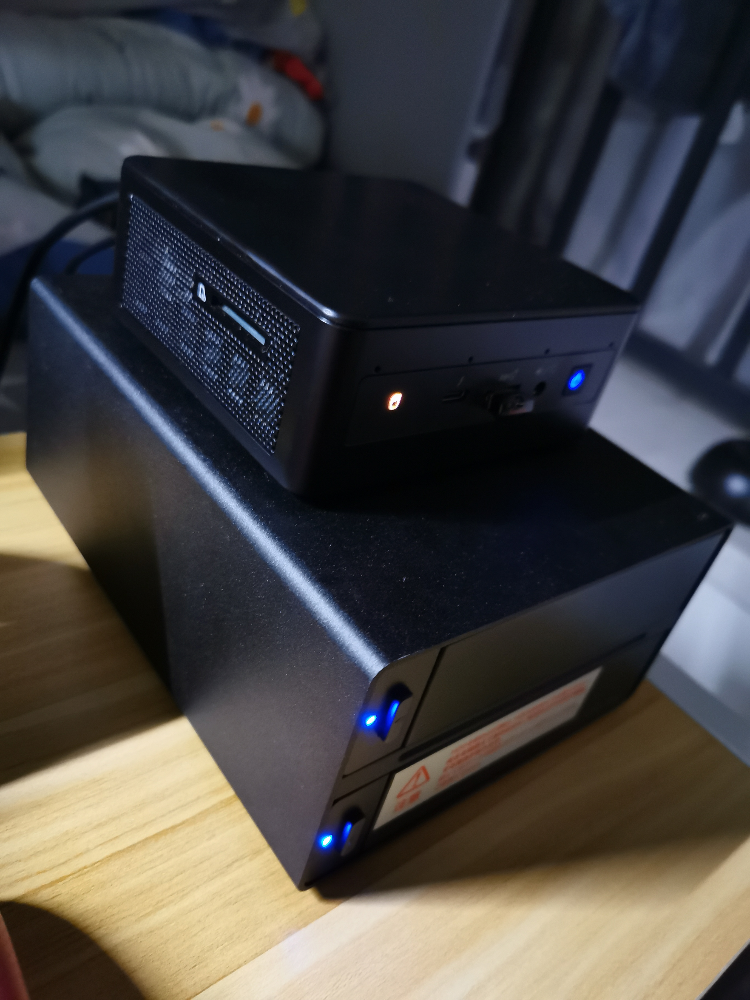
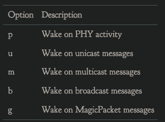
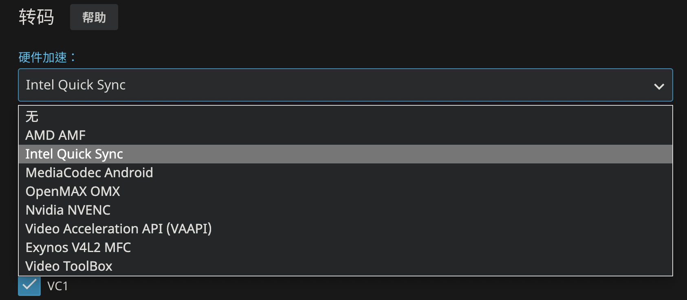
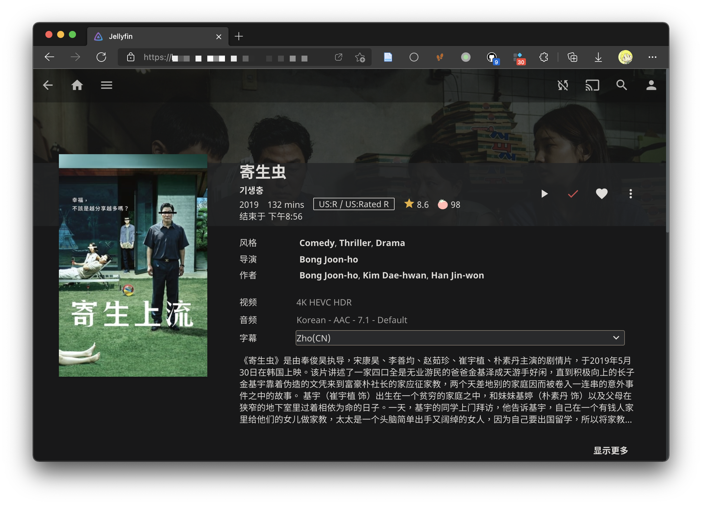
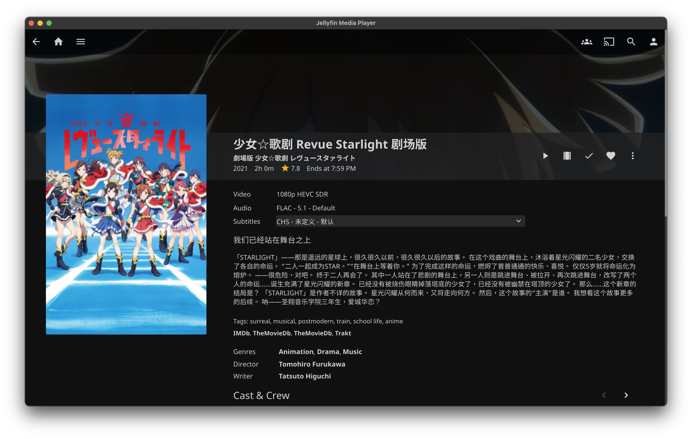
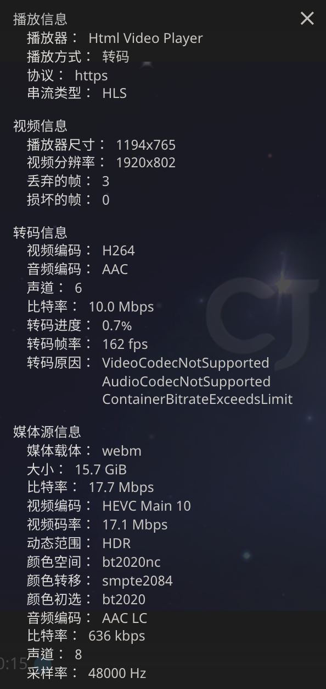
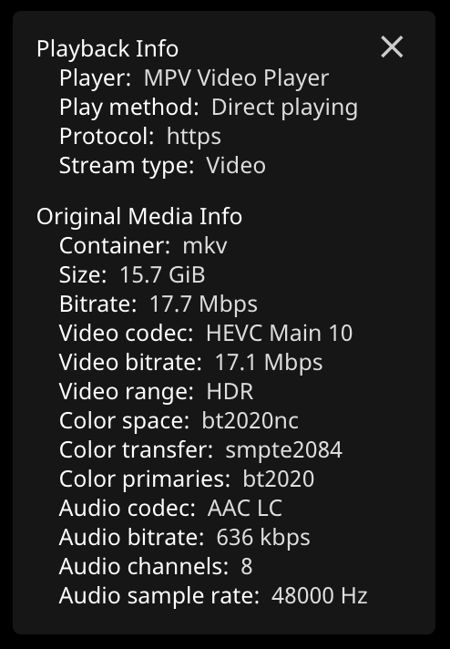

## 写在前面

为什么我会突然想搞一台NAS呢，我这么问自己，仔细回想一下大概是因为自从番剧需要进行审核才能上映的政策出台后，我就准备了一块海康威视的1T ssd接一块败家之眼的m2硬盘盒用来存自己下载的番剧，同时也方便和朋友分享；后来阿b推出了放映室的功能，在网页上就可以很方便的和朋友一同看番看电影。但这样终究是不方便，首先放映室的内容只能先定于阿b已经拥有版权的内容，其次，你的朋友最好还要有大会员。好在我本身就是个爱折腾的人，刚好前段时间给群友搞了一个ts服务器来让群友们吹水聊天以及游戏语音，我就开始想能不能通过自建的服务器也实现一个类似的流媒体平台，随时和朋友分享自己私藏的电影番剧。

假如有这样一个场景：某天有朋友（小姐姐）想看个电影但苦于没有资源，又不想去各种牛皮癣广告横飞的小网站，只得求助于你。你虽然早已掌握科学上网快速通过各种途径网罗了种子资源，熟练地运用bt下载器下载到了最新的4K HDR 10bit资源，那么你该怎么和远在网线另一端的她分享呢？当然你可以把bt文件丢过去耐心地教她怎么用FDM来下载，但是，如果此时我们能有一个自己的流媒体服务器，不就可以随时随地的给任何人分享硬盘里的片了吗？

之前发现小区是有公网ip的，在暴力破解了宽带账号把光猫改成桥接以后，就可以直通外网了，尽管上行带宽并不富裕，但这么好的资源不拿来搭服务器简直浪费，而又“恰好”实验室发电脑是一台最新nuc11，配了11代的酷睿i7-1165G7，平时都用mac的我正愁该如何在毕业前发挥它的剩余价值，这波天时地利就被赶上了，于是就有了下面的折腾。

## 方案探索

基于nas的媒体中心其实已经有不少成熟解决方案，Emby，Plex以及开源的Jellyfin都是最常用的。我们只需要吧nas里存的片共享给流媒体服务器，然后在外网暴露端口就行。这里主要又一些其他考虑：当前的主机需要在毕业后归还的，因此如何能够在保留大部分数据配置的情况下做到快速迁移整个nas系统便是我首先考虑的问题。同时之后肯定会再用一台自己组装的nas代替现在的系统，如何最大化复用硬件也是需要考虑的。因此在选择硬件和系统的时候就会有意留意以上两点。

### 硬件

硬件选择比较简单，主要思想通过主机+硬盘盒raid的方式来实现：

主机用的是白嫖的Intel NUC11PAHi7 猎豹峡谷，40w的TDP，硬盘从海鲜市场捡了两块4T的希捷酷狼，硬盘盒同样也是从海鲜市场捡的二手世特力双盘位带raid的硬盘盒，可以两块组硬raid1。同时配了APC的BK650M2 UPS来保证电源的稳定。

刚拿到世特力的硬盘盒时发现卖家并没有给原装的脚垫，直接放到桌子上会有挺强烈的共振，怕搞坏硬盘临时垫了块纸板，放假回来后买了带一点厚度的减震贴贴到四个角，瞬间稳稳当当，噪音也减弱了不少。4T的酷狼是5400转，本身声音也很小，房间不大我都是直接放到床边，几乎听不到什么声音，室友也表示很安静没有什么影响。

硬盘盒之后组装新nas后还可以拿来扩展新nas的空间，缺点就是usb不支持硬盘smart信息的查询，尽管它还带有一个esata的接口，不知道是否支持。



### nas底层系统选择

在选择系统之前首先还是要明确需求，对我来说，需求主要有以下几点：

1. 可以7x24稳定运行
2. 可以硬件直通方便媒体服务器使用硬件编解码
3. 可以开虚拟机
4. 对Docker容器能有较好的支持
5. 可以方便备份迁移

现在市面上几乎所有系统都可以用来做nas，因为对linux较为熟悉且为了获得原生的docker性能和体验，我在一开始就排除的windows系统，另外FreeNas（TrueNas）基于内存的缓存策略推荐使用大内存+ECC，硬件不具备也暂时不考虑，所以主要的选择在以下几个系统之间：

* EXSI、PVE等

  这些虚拟机管理平台对于多虚拟机的需求还是很容易满足的，其中exsi作为企业级的平台虽然对于个人使用时免费的，但对于家用硬件设备可能存在兼容性问题，nuc上装的exsi7.0就遇到了没有网卡驱动以及显卡无法直通的问题等，有些可以自己手动解决，也有一些问题需要官方支持目前来说是无解的，这也是耗费了我不少时间去验证最后得出的结论。总之如果不是较新的硬件，没有兼容性问题的前提下，exsi易用的交互界面以及一些成熟的功能（硬件直通，虚拟机快照备份）可能会有很大优势，除此之外基于linux的pve应该可以提高较好的软硬件兼容性

* OpenMediaVault

  omv是我在exsi上用来体验的nas系统，开源免费，相对于TrueNas它更接近于传统nas系统，磁盘权限管理、软raid等功能都是有的，docker管理需要借助portainer插件也可以满足。这方面我没有深入体验也不过多评论了。

* Ubuntu对我来说就是上手容易，相关社区生态比较活跃。我一开始也是从ubuntu开始配置起，这篇博客也主要是讲ubuntu上的一些nas的基本配置方便之后查询。在使用了一段时间后，确实可以满足我的基本需求，docker来跑一些nas服务，kvm来配置虚拟机，同时还可以当远程linux主机跑一些程序或者配置远程开发环境。总之，既然是linux，那么它几乎可以满足一切想象的需求。但缺点也很明显，不好迁移，本来这样一个系统如果是建立在exsi上可以方便的做到迁移，但是由于前述的一些原因，以及对于多硬盘的管理也不太直观便捷，有一定的维护成本。在考虑的一段时间后不得不放弃这个方案，转而寻求一些更加稳定方便的方案，于是我便注意到了Unraid。

* Unraid

  Unraid最吸引我的只有两点：

  1. 系统安装在一块u盘之中，不占用nuc里的固态硬盘，这样固态可以拿出来当缓存，迁移系统只需要把u盘硬盘装在另一台电脑，系统配置可以完整保留。
  2. 方便直观的磁盘阵列管理，特别是unraid的理念可以方便添加减少硬盘而不需要重新构建阵列，在不追求读写性能的前提下可以说十分好用了。

  当然缺点就是它是一个收费的系统，价格也不便宜，我目前也在试用体验期，等一段时间的使用后可以考虑在聊聊感受。

### 硬件直通

这里的需求主要还是用于硬件解码或者做软路由直通网卡用，前面也已经提到一些，如果不追求最新的硬件，那么exsi系统应该可以很好的满足需求，否则需要考虑原生的linux或者pve系统。另外硬件解码可以直接在docker容器里调用显卡，只需要关注所选用的系统是否有对应显卡的驱动即可。

## 安装过程

这里简单记录一下当时主要的安装配置过程，想看最终效果的可以直接点[这里](#最终效果)

### 配置UPS

ups几乎是nas必备了，我选用的是APC的BK650M2，具体配置方法可以参考这篇文章：[使用NUT解决BK650M2-CH失联问题（一） - 简书 (jianshu.com)](https://www.jianshu.com/p/bb3a52916d79)

```bash
sudo apt install nut
```

### 配置邮件提醒

```bash
sudo apt install mailutils
```

### 磁盘分区 fdisk，parted和gdisk

fdisk:

```
➜  ~ sudo fdisk /dev/sda

Welcome to fdisk (util-linux 2.34).
Changes will remain in memory only, until you decide to write them.
Be careful before using the write command.

Device does not contain a recognized partition table.
The size of this disk is 3.7 TiB (4000787030016 bytes). DOS partition table format cannot be used on drives for volumes larger than 2199023255040 bytes for 512-byte sectors. Use GUID partition table format (GPT).

Created a new DOS disklabel with disk identifier 0x277fe383.
```

由于MBR分区表并不支持2T以上的容量，必须该用GPT分区表

我们先使用parted分区:

```
➜  ~ sudo parted /dev/sda
GNU Parted 3.3
Using /dev/sda
Welcome to GNU Parted! Type 'help' to view a list of commands.
(parted) print
Error: /dev/sda: unrecognised disk label
Model: ST4000VN 008-2DR166 (scsi)
Disk /dev/sda: 4001GB
Sector size (logical/physical): 512B/512B
Partition Table: unknown
Disk Flags:
(parted) mklabel gpt
(parted) print
Model: ST4000VN 008-2DR166 (scsi)
Disk /dev/sda: 4001GB
Sector size (logical/physical): 512B/512B
Partition Table: gpt
Disk Flags:

Number  Start  End  Size  File system  Name  Flags

(parted) mkpart primary 0GB 4001GB
(parted) print
Model: ST4000VN 008-2DR166 (scsi)
Disk /dev/sda: 4001GB
Sector size (logical/physical): 512B/512B
Partition Table: gpt
Disk Flags:

Number  Start   End     Size    File system  Name     Flags
 1      33.6MB  4001GB  4001GB               primary

(parted) quit
Information: You may need to update /etc/fstab.
```

然后使用mkfs创建文件系统：

```
➜  ~ sudo mkfs.ext4 /dev/sda1
mke2fs 1.45.5 (07-Jan-2020)
/dev/sda1 alignment is offset by 512 bytes.
This may result in very poor performance, (re)-partitioning suggested.
Creating filesystem with 976741831 4k blocks and 244187136 inodes
Filesystem UUID: be74b765-92e7-4d99-a203-36863909129b
Superblock backups stored on blocks:
	32768, 98304, 163840, 229376, 294912, 819200, 884736, 1605632, 2654208,
	4096000, 7962624, 11239424, 20480000, 23887872, 71663616, 78675968,
	102400000, 214990848, 512000000, 550731776, 644972544
```

parted的默认起始扇区为65535，并不是8的整数倍，并且存在不少浪费，转用gdisk试一下

```
Command (? for help): p
Disk /dev/sda: 7814037168 sectors, 3.6 TiB
Model: 008-2DR166
Sector size (logical/physical): 512/512 bytes
Disk identifier (GUID): C32F7F72-31A6-4EAC-BB7A-5E9EF5E88865
Partition table holds up to 128 entries
Main partition table begins at sector 2 and ends at sector 33
First usable sector is 34, last usable sector is 7814037134
Partitions will be aligned on 2048-sector boundaries
Total free space is 2014 sectors (1007.0 KiB)

Number  Start (sector)    End (sector)  Size       Code  Name
   1            2048      7814037134   3.6 TiB     8300  Linux filesystem
```

lsblk看一下确认分区大小

```
sda                         8:0    0   3.7T  0 disk
└─sda1                      8:1    0   3.7T  0 part
```

通过mkfs在对应的分区上创建文件系统:

```
➜  ~ sudo mkfs.ext4 /dev/sda1
mke2fs 1.45.5 (07-Jan-2020)
Creating filesystem with 976754385 4k blocks and 244195328 inodes
Filesystem UUID: 678f5019-216a-4d94-95ab-ca4b219b0a95
Superblock backups stored on blocks:
	32768, 98304, 163840, 229376, 294912, 819200, 884736, 1605632, 2654208,
	4096000, 7962624, 11239424, 20480000, 23887872, 71663616, 78675968,
	102400000, 214990848, 512000000, 550731776, 644972544

Allocating group tables: done
Writing inode tables: done
Creating journal (262144 blocks): done
Writing superblocks and filesystem accounting information: done
```

### 自动挂载

自动挂载主要是通过查询对应磁盘的UUID，然后讲挂载命令写入系统的自动挂载文件

```bash
blkid
vim echo "UUID=e943fbb7-020a-4c64-a48a-2597eb2496df /data ext4 defaults 0 0" >> /etc/fstab
# 或者直接 vim /etc/fstab 编辑文件按上面👆的格式添加一行：设备UUID 挂载点 文件系统 挂载选项 是否备份 是否检测
sudo mount -a # 挂载所有fstab中的设备
```

### 配置nuc11显卡驱动

Intel对ubuntu 20.04的支持还是比较好的，可以按官方文档来装驱动，see：[GPGPU: Ubuntu 20.04 (focal) (intel.com)](https://dgpu-docs.intel.com/installation-guides/ubuntu/ubuntu-focal.html)

```shell
sudo apt-get install \
  intel-opencl-icd \
  intel-level-zero-gpu level-zero \
  intel-media-va-driver-non-free libmfx1
```

安装驱动后没有看到/dev/dri文件夹，发现iris xe显卡有一些额外的包需要安装：

see: [Ubuntu 20.04 no driver loaded for Intel Iris Xe Graphics - Ask Ubuntu](https://askubuntu.com/questions/1299067/ubuntu-20-04-no-driver-loaded-for-intel-iris-xe-graphics)

```shell
sudo apt update
sudo apt install linux-oem-20.04
sudo reboot
```

### WOL配置

前提是需要在主板bios里打开WOL设置，具体参考对应主板的bios设置方法

```bash
# 安装工具
sudo apt install ethtool
# 查看网卡设备，找到对应物理网卡
ip addr
# 用 ethtool 查看是否支持Wake-On-Lan
sudo ethtool eht0
```

可能会看到以下输出：

```
ethtool eth0
Settings for eth0:
        Supported ports: [  ]
        Supported link modes:   10baseT/Half 10baseT/Full
                                100baseT/Half 100baseT/Full
                                1000baseT/Full
                                2500baseT/Full
        Supported pause frame use: Symmetric
        Supports auto-negotiation: Yes
        Supported FEC modes: Not reported
        Advertised link modes:  10baseT/Half 10baseT/Full
                                100baseT/Half 100baseT/Full
                                1000baseT/Full
                                2500baseT/Full
        Advertised pause frame use: Symmetric
        Advertised auto-negotiation: Yes
        Advertised FEC modes: Not reported
        Speed: 2500Mb/s
        Duplex: Full
        Auto-negotiation: on
        Port: Twisted Pair
        PHYAD: 0
        Transceiver: internal
        MDI-X: off (auto)
        Supports Wake-on: pumbg
        Wake-on: g
        Current message level: 0x00000007 (7)
                               drv probe link
        Link detected: yes
```

主要关注这两行:

```
Supports Wake-on: pumbg
Wake-on: g
```

上面的pumbg代表支持唤醒的类型：



下面表示当前的状态，如果是`d`代表`disable`，可以通过下面的方式开启：

```bash
sudo ethtool -s eth0 wol g
```

其他配置可以参考这篇文章：[Enabling Wake-On-LAN (In Ubuntu 20.10) | The Cloistered Monkey (necromuralist.github.io)](https://necromuralist.github.io/posts/enabling-wake-on-lan/)

### exfat in ubuntu

由于我之前为了在多平台之间通用，移动硬盘被格式化为零exfat格式，linux默认读写exfat的时候偶尔会有问题，安装额外的包来获得更稳定的兼容：

```shell
sudo apt install exfat-utils
```

### snap docker

配置好docker compose后，启动遇到了下面的问题：

```
➜ docker-compose up -d
Starting jellyfin ...
Starting webdav      ... error
Starting qbittorrent ...

Starting qbittorrent ... error
Starting jellyfin    ... error
ERROR: for qbittorrent  Cannot start service qbittorrent: error while creating mount source path '/data/config/qbittorrent': mkdir /data: read-only file system

ERROR: for jellyfin  Cannot start service jellyfin: error while creating mount source path '/data/config/jellyfin': mkdir /data: read-only file system

ERROR: for webdav  Cannot start service webdav: error while creating mount source path '/data/share': mkdir /data: read-only file system

ERROR: for qbittorrent  Cannot start service qbittorrent: error while creating mount source path '/data/config/qbittorrent': mkdir /data: read-only file system

ERROR: for jellyfin  Cannot start service jellyfin: error while creating mount source path '/data/config/jellyfin': mkdir /data: read-only file system
ERROR: Encountered errors while bringing up the project.
```

查了一下，是snap自带docker的问题，删除ubuntu自带的docker重新安装官方的docker即可

[ubuntu - Docker - mkdir read-only file system - Stack Overflow](https://stackoverflow.com/questions/52526219/docker-mkdir-read-only-file-system)

### Jellyfin 硬解

实验室给的这个nuc11的这块1165g7自带来一个蓝厂最新的iris Xe核显，96EU，性能应该是同代核显里最强的了，据说能有mx350的水平？不拿来当解码器真是浪费了。

但问题也就出在这块核显实在太新了，需要新的驱动程序，配置方式也有一些不同，因此考虑显卡直通之前，一定先要调研好软硬件的兼容性。

Jellyfin的官方文档：[Hardware Acceleration | Documentation - Jellyfin Project](https://jellyfin.org/docs/general/administration/hardware-acceleration.html#tips-for-intel-gen9-and-gen11-when-using-vaapi-or-qsv-on-linux)，中有这么一段话：

```
For Intel Comet Lake or newer iGPUs, the legacy i965 VA-API driver is incompatible with your hardware. Please follow the instructions from Configuring Intel QuickSync(QSV) on Debian/Ubuntu to get the newer iHD driver.
```

所以不能在使用之前的VAAPI，转而使用最新的QuickSync方式：



11代cpu核显需要使用新的驱动，而且因为licenses的原因docker镜像里不能包含驱动，所以需要手动安装：

```shell
sudo apt update
sudo apt install vainfo intel-media-va-driver-non-free -y
```

安装好驱动后，`ls /dev/dri`检查一下是否有对应的目录

```shell
➜  ~ ls /dev/dri
by-path  card0  renderD128
```

然后就可以在docker-compose文件中把显卡驱动共享给容器，同时记得需要给容器添加到render的用户组里

```yaml
version: "3.9"
services:
  jellyfin:
    image: linuxserver/jellyfin:10.7.7
    container_name: jellyfin
    ports:
    	- ...
    group_add:
      - 109 # add to render group, see: cat /etc/group | grep render
    environment:
    	- ...
    devices:
      - /dev/dri:/dev/dri # Intel 集显驱动
```

或者把当前用户添加到render组同时通过设置容器内的启动用户为当前用户来实现统一的目的

```shell
sudo usermod -a -G render [username]
```

解码 2160p HEVC 10bit视频测试一下，安装intel-gpu-tool查看占用，可以看到确实有用到显卡的解码性能：

```shell
sudo apt install intel-gpu-tools
sudo intel-gpu-top
intel-gpu-top - 1100/1299 MHz;    0% RC6; ----- (null);     3610 irqs/s

      IMC reads:   ------ (null)/s
     IMC writes:   ------ (null)/s

          ENGINE      BUSY                                                                                                                    MI_SEMA MI_WAIT
     Render/3D/0  100.00% |████████████████████████████████████████████████████████████████████████████████████████████████████████████████▉|     36%      0%
       Blitter/0    0.00% |                                                                                                                 |      0%      0%
         Video/0   46.35% |████████████████████████████████████████████████████▎                                                            |      0%      0%
         Video/1   39.64% |████████████████████████████████████████████▊                                                                    |      0%      0%
  VideoEnhance/0   38.52% |███████████████████████████████████████████▌                                                                     |      0%      0%


```


### qBittorrent

直接访问页面会提示Unauthorized：[qBittorent UI returns 401 (blank page) when accessed through Kubernetes proxy · Issue #8095 · qbittorrent/qBittorrent (github.com)](https://github.com/qbittorrent/qBittorrent/issues/8095#issuecomment-472740702)

需要在配置文件`qBittorrent.conf`加一行（注意需要通过映射目录做好配置的持久化）

```
WebUI\HostHeaderValidation=false
```

重启容器，然后访问页面，使用默认账户admin，密码adminadmin登陆

### 私有云盘

这里可以选择seafile和nextcloud，或者直接搭一个webdav服务器（可以参考最后的docker-compose配置），不过测试了下性能不太好。

## 最终效果

做好端口映射后公网就可以访问网页：

我在这里顺手为域名去加了证书来支持https访问



直接访问网页是最方便的方式，但是受限与浏览器的原因，Chromium系的浏览器不能使用hevc的硬解，win10下的Edge应该可以通过额外的插件来实现hevc硬解，因此，想要通过客户端硬解来节省可怜的小水管带宽的话，可以使用Jellyfin的客户端：[jellyfin/jellyfin-media-player: Jellyfin Desktop Client based on Plex Media Player (github.com)](https://github.com/jellyfin/jellyfin-media-player)，或者用safari等浏览器

最好提前用tmm等工具搜刮一下相关的介绍/图片补充元数据，然后统一重命名（为了不妨碍做种，我选择用`cp -al`硬连接到Jellyfin的目录，再改名，这样也不会占用额外的空间）：




可以看到Jellyfin演员配图质量还是挺高的：


转码速度还是挺快的，瓶颈主要是在家里的上行带宽只有可怜的10m多，所以网页端转码，最多只能开到1080p，码率也不敢太高更不可能多人一起看了， 而如果用客户端或者safari浏览器硬解，4K direct几乎可以十分流畅的播放：

 


### docker compose配置参考

最后附一个docker-compose的配置参考：

```yaml
version: "3.9"
services:
  jellyfin:
    image: linuxserver/jellyfin:10.7.7
    container_name: jellyfin
    ports:
      - 8096:8096 # web ui
      - 8920:8920 # https
      - 7359:7359/udp
      - 1900:1900/udp
    group_add:
      - 109 # add to render group, see: cat /etc/group | grep render
    environment:
      - PUID=1000
      - PGID=1000
      - TZ=Asia/Shanghai
    volumes:
      - /data/config/jellyfin:/config # 配置
      - jfcache:/cache
      - /data/share/media:/data
      - /data/share/pt/qbittorrent/downloads/:/data/downloads:ro
      - /data/cert:/cert
    devices:
      - /dev/dri:/dev/dri # Intel 集显驱动
    restart: unless-stopped

  qbittorrent:
    image: linuxserver/qbittorrent:4.4.0
    container_name: qbittorrent
    ports:
      - 6881:6881
      - 6881:6881/udp
      - 8080:8080 # web ui
    environment:
      - PUID=1000
      - PGID=1000
      - TZ=Asia/Shanghai
      - WEBUI_PORT=8080
    volumes:
      - /data/config/qbittorrent:/config
      - /data/share/pt/qbittorrent/downloads:/downloads
      - /data/cert:/cert
    restart: unless-stopped

  webdav: # webdav服务器，外网使用性能不太好
    image: hacdias/webdav:v4.1.1
    container_name: webdav
    ports:
      - 8081:80
    environment:
      - TZ=Asia/Shanghai
    command: [ "--config", "/opt/webdav.config.yml" ]
    volumes:
      - /data/share:/data
      - /data/config/webdav/webdav.config.yml:/opt/webdav.config.yml
      - /data/cert:/cert
    restart: unless-stopped

  tmm: # 一个影音刮削软件，可以直接部署到服务器上通过vnr远程使用
    image: tinymediamanager/tinymediamanager:4.2.5.1
    container_name: tmm
    ports:
      - 4000:4000
    environment:
      - USER_ID=1000
      - GROUP_ID=1000
      - TZ=Asia/Shanghai
    volumes:
      - /data/config/tinymediamanager:/data
      - /data/share/media:/media
      - /data/cert:/cert
    restart: unless-stopped

volumes:
  jfcache:
```


