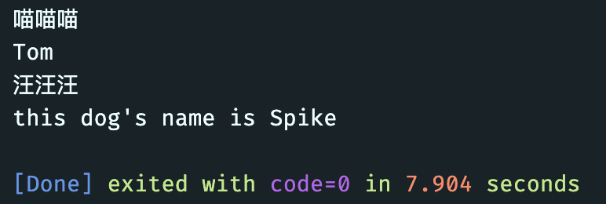
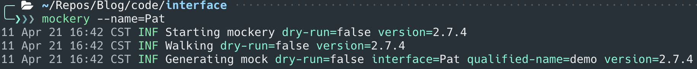
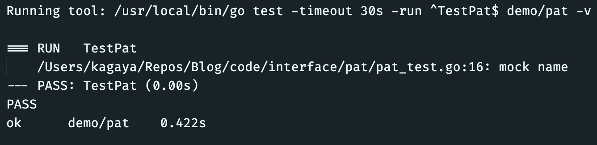
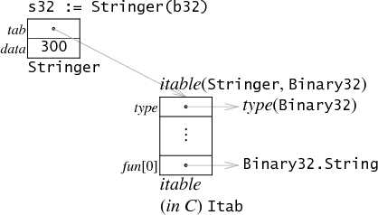

从今天开始打算尝试开一个系列的坑，分享一些Golang学习过程中觉得有趣的设计，系列的名字就打算叫**Amazing Go**。这个系列理论上并不打算作为一个语言教程，你可以单纯把它理解为一个Golang爱好者为了向别人介绍这门语言的优秀设计，也可以看作是对于Golang的某一项具体特性所做的原理剖析。我希望在每一篇文章中在介绍基础语法的基础上，挖掘背后的设计思路和原理，又或者从开发者的角度提供一些新的思考。

希望能对你有所帮助。

本篇就是这个系列的第一篇，我打算从我最喜欢的Golang特性，也是众多gopher津津乐道的Go特性——Interface说起。

## Why Interface? 

在介绍Golang的接口语法之前，我们先简单回顾一下什么是接口。IOP（Interface Oriented Programing），即面向接口编程，尽管还是属于OOP面向对象编程的范畴，这也是**多态(polymorphism)**的重要实现手段，但我觉得还是有必要单独拿出来说。现在复杂的软件系统不是由一个人单独完成的，软件设计的工作往往会涉及到一个团队之间的沟通协作，我们也总希望软件具有良好的可扩展性和可维护性。同时，在敏捷软件开发过程中，软件拥有了生命力，能够快速迭代推陈出新。因此，我们希望通过一种方法来隐藏软件设计中的部分复杂度，对复杂的部分进行良好的封装来降低协作成本，提高开发效率，于是我们引入了接口（Interface）这一概念：

> In computing, an **interface** is a shared boundary across which two or more separate components of a computer system exchange information.[^wiki interface]

**接口**的作用其实就是为不同层级的模块提供了一个定义好的**中间层**，上游不再需要依赖下游的具体实现，充分地对上下游进行了解耦[^golang-101]。

我认为接口是人类工程学中的一次伟大创造，有了接口，我们不再需要了解接口背后的实现方法，大大简化了使用门槛：就如同我们使用插座不需要了解火线和零线是如何通过交流电把能量传递到用电器中，在这里，插座就是一种接口，可以方便给所有符合接口标准的用电器提供电能，接口的好处不再赘述，下面会先简单介绍一下C++和Java等传统OOP语言的接口设计，并在下一节中着重介绍Golang中的接口设计。

### C++ Interface

我们先简单复习一下C++，接口在C++中尽管没有专门的关键字，但是一般使用虚函数或纯虚函数来声明一个**抽象类**来表示接口：

```c++
class Pat
{
public:
    string name;
    // 纯虚函数，要求派生类必须实现
    virtual void bark() = 0;
    // 虚函数，提供默认实现
    virtual string getName()
    {
        return name;
    }
};

class Cat : public Pat
{
public:
    void bark()
    {
        cout << "喵喵喵" << endl;
    }
};

class Dog : public Pat
{
public:
    void bark()
    {
        cout << "汪汪汪" << endl;
    }
    string getName()
    {
        return "this dog's name is " + this->name;
    }
};
```

我们定义了一个基础类Pat，它包含两个虚函数（其中一个为纯虚函数），我们分别通过Cat类和Dog类来继承Pat类并实现对应的函数，从而通过Pat类的指针调用派生子类的方法

```c++
int main()
{
    Cat c;
    Dog d;
    c.name = "Tom";
    d.name = "Spike";

    Pat *p = &c;
    p->bark();
    cout << p->getName() << endl;

    p = &d;
    p->bark();
    cout << p->getName() << endl;

    return 0;
}
```

输出结果：



这里本质上就是实现了一个接口`Pat`，对于使用者来说，不需要去关心`Pat`到底是`Dog`还是`Cat`，只需要知道它有两个方法，`bark`和`getName`，其中`bark`对于派生类来说必须有自己的实现方式，而`getName`提供了默认的实现，即便`Cat`类没有定义这个方法，但仍然可以可以通过基类指针调用并输出。对外只需提供`Pat`接口，隐藏了内部具体的实现细节。

C++没有专门的Interface关键字，通过提供虚函数来实现接口特性，一个类只能继承一个虚函数，同时额外区分了提供默认实现和强制子类实现的函数，不含纯虚函数的抽象类是可以被实例化的，这是非常不合理的。除此之外，理论上接口应该**只关注操作方法**，作为接口的基类函数却可以定义自己的公有和私有变量，造成一定的耦合，对于接口的实现来说往往会带来一些麻烦。

另外，作为动态语言的Python，也是通过抽象类来实现类似接口的功能。

### Java Interface

Java继承了C++的抽象类定义的同时，还专门提供了interface关键字，都是用来对对象方法提供抽象的接口。

1. 抽象类中的方法可以有方法体，就是能实现方法的具体功能，但是接口中的方法不行。
2. 抽象类中的成员变量可以是各种类型的，而接口中的成员变量只能是 **public static final** 类型的。
3. 接口中不能含有静态代码块以及静态方法(用 static 修饰的方法)，而抽象类是可以有静态代码块和静态方法。（jdk1.8后可以接口可以包含静态方法和实现）
4.  一个类只能继承一个抽象类，而一个类却可以实现多个接口。

Java中完善了C++中抽象类的一些问题（比如可以实例化）并单独提供了Interface关键字来针对接口的抽象，但是在实际使用时，往往优先使用接口而不是抽象类，这可能会给开发人员带来一些困扰。

抽象类的例子与C++类似，我们还是看一下上面的例子，使用Java interface的实现：

```java
// Pat.java
package demo;

public interface Pat {

    // 接口中可以声明变量，默认为 public static final
    String name = "pat";

    // 默认为 public abstract
    void bark();

    String getName();

    // 接口中可以实现静态函数
    static String getPatName() {
        return name;
    }
}

// Cat.java
package demo;

public class Cat implements Pat {
    public String name;

    public Cat(String name) {
        this.name = name;
    }

    public void bark() {
        System.out.println("喵喵喵");
    }

    public String getName() {
        return name;
    }
}

// Dog.java
package demo;

public class Dog implements Pat {
    public String name;

    public Dog(String name) {
        this.name = name;
    }

    public void bark() {
        System.out.println("汪汪汪");
    }

    public String getName() {
        return "this dog's name is " + name;
    }
}

// demo.java
package demo;

import java.lang.*;

public class demo {
    public static void main(String[] args) {
        Cat c = new Cat("Tom");
        Dog d = new Dog("Spike");

        Pat p = c;
        p.bark();
        System.out.println(p.getName());

        p = d;
        p.bark();
        System.out.println(p.getName());
    }
}
```

输出同上，可以看到Java借助interface关键字轻松实现多态，并且interface有着抽象类所没有的严格限制，比如只能声明抽象函数，进一步分离了对象的方法声明和方法实现，实现接口也需要使用`implements`关键字显式声明，可以同时声明实现多个接口。

特别的是，Java中的接口仍然选择保留声明变量，但声明变量和实现函数必须是静态的，变量还限制为final，且方法不能通过实现类来重写和调用，即不能提供方法的默认实现。默认实现仍然需要借助抽象类来提供，个人觉得这还是有一些复杂，我们再做抽象时不得不考虑我们应该使用抽象类还是使用接口。

## Interface in Go

Go作为一门年轻的高级语言，自然也吸取了C++和Java中优秀的语法设计，同时以围绕简单直接的设计哲学，Go对于接口的设计也形成了自己独特的风格。

Go语言的设计哲学之一就是**简单直接，少即是多**，作为一门现代编程语言，他甚至抛弃了OOP中关键的`class`关键字，转而去拥抱类似C中的`struct`。但和C这种纯过程式的语言不同，Go依然拥有面向对象的特性，让面向对象的软件设计方法依然在Golang中发光发热。

另外补充一下，Go由于同时抛弃了public、private、protected等关键字，对于公有和私有方法/变量的处理是通过名称**首字母的大小**写来区分，大写字母开头即为公有方法/变量，小写字母开头则为私有方法/变量。

说回到接口，在Go中，也与Java一样提供了interface关键字，通过interface来声明一个接口：

```go
type Pet interface {
	Bark()
	GetName() string
}
```

Go中的接口声明显得十分直观简单，只包含接口名+包含的方法，不允许声明变量，不允许有方法实现，彻底将对象中的方法抽象了出来，没有一点多余的要素，只告诉使用方这个接口包含哪些方法可以使用。

更加令人惊喜的是，Go中的接口实现方法采用了类似**鸭子类型**的实现策略。

### Duck Typing

鸭子类型（Duck Typing）[^duck-typing]是一种动态类型语言的设计风格：

> If it walks like a duck and it quacks like a duck, then it must be a duck

鸭子类型在Python等**动态类型**的语言中得到了非常广泛的应用，在鸭子类型中，关注点在于**对象的行为**，能作什么，而不是关注对象所属的类型。这样，我们就可以在不继承对象的情况下实现了多态。

```python
class Duck:
    def quack(self):
        print "这鸭子正在嘎嘎叫"

    def feathers(self):
        print "这鸭子拥有白色和灰色的羽毛"

class Person:
    def quack(self):
        print "这人正在模仿鸭子"

    def feathers(self):
        print "这人在地上拿起1根羽毛然后给其他人看"

def in_the_forest(duck):
    duck.quack()
    duck.feathers()

def game():
    donald = Duck()
    john = Person()
    in_the_forest(donald)
    in_the_forest(john)

game()
```

如上的python代码中，`in_the_forest`方法的形参并不是一个被继承的父类对象类型，而是假定duck参数包含`quack`与`feathers`两个方法，或只要包含着两个方法的对象，就认为是合法的参数，解耦了方法的实现和声明。

这其实与接口的思想不谋而合，但有区别的是，实现方也不用显示定义了实现了哪些接口，调用方也不关心谁实现了这些方法。这其实也导致了很多批评的声音：

* Duck Typing需要动态类型的支持，使得将可能的错误发生转移到了运行时，并且难以通过静态分析做类型推断，反而增加了程序员的负担。
* “如果它走起来像鸭子并且叫起来像鸭子”，它也可以是一只正在模仿鸭子的龙。尽管它们可以模仿鸭子，但也许你不总是想让龙进入池塘。

当然这不妨碍仍有很多人喜欢Duck Typing，尤其是众多Gopher。

### What's different in go

前面也说了，Golang的接口提供了**类似鸭子类型**的特性，为什么说类似呢，一个最重要的不同就是Golang作为一门静态类型的语言却实现了类似动态语言的特性，我们还是看上面猫和狗的例子：

```go
type Cat struct {
	name string
}

func (c Cat) Bark() {
	fmt.Println("喵喵喵")
}

func (c *Cat) GetName() string {
	return c.name
}

type Dog struct {
	name string
}

func (d Dog) Bark() {
	fmt.Println("汪汪汪")
}

func (d Dog) GetName() string {
	return "this dog's name is " + d.name
}
```

如果没有上文，我相信没有人知道这里的Dog和Cat已经实现了前文定义的Pat接口，这就是Duck Typing的魅力。

```go
func main() {
	var c Cat
	var d Dog
	c.name = "Tom"
	d.name = "Spike"

	var p Pat // 接口类型
	p = &c
	p.Bark() // 喵喵喵
	fmt.Println(p.GetName()) // Tom

	p = d
	p.Bark() // 汪汪汪
	fmt.Println(p.GetName()) // this dog's name is Spike
}
```

由于Go是一门静态类型的语言，意味着可以通过静态类型检查让你你可以放心的使用鸭子类型，而避免了可能的类型错误同时还能享受鸭子类型带来的简洁高效的语法。

有读者可能已经注意到了，我在接口类型变量p赋值时，第一次使用了指针，而第二次原变量，这里涉及到了指针结构体和原结构体所包含方法列表的范围，有兴趣的读者可以思考一下为什么。

### One more case

刚才这个例子或许也还不足以体现Go Interface的神奇之处，那么再来看看这个例子。

Golang诞生至今，最成功的接口定义之一就是`io.Writer`和`io.Reader`接口：

```go
type Writer interface {
    Write(p []byte) (n int, err error)
}

type Reader interface {
    Read(p []byte) (n int, err error)
}
```

两个接口分别完美继承了Unix中一切皆文件的思想，对数据源中的数据操作做了良好的抽象，任何数据源只要实现了这两个接口，就可以统一操作方法，方便对接任何调用方[^go io/fs design]：

* 字符串

  ```go
  r := strings.NewReader("hello, go")
  r.Read(...)
  ```

* 字节序列

  ```go
  r := bytes.NewReader([]byte("hello, go"))
  r.Read(...)
  ```

* 文件

  ```go
  f := os.Open("foo.txt") // f 满足io.Reader
  f.Read(...)
  ```

* tcp socket

  ```go
  r, err :=  net.DialTCP("192.168.0.10", nil, raddr *TCPAddr) (*TCPConn, error)
  r.Read(...)
  ```

* http request

  ```go
  r := bytes.NewReader([]byte("hello, go"))
  req, err := http.NewRequestWithContext(ctx, "POST", url, r)
  ```

* 读取压缩文件

  ```go
  func main() {
      f, err := os.Open("hello.txt.gz")
      if err != nil {
          log.Fatal(err)
      }
  
      zr, err := gzip.NewReader(f)
      if err != nil {
          log.Fatal(err)
      }
  
      if _, err := io.Copy(os.Stdout, zr); err != nil { // 读取到stdout
          log.Fatal(err)
      }
  
      if err := zr.Close(); err != nil {
          log.Fatal(err)
      }
  }
  ```

Writer和Reader接口的设计十分简洁，同样继续遵循了Golang的设计哲学，Go语言lib中的大部分接口都是如此，只包含极少数的方法，同时遵循SOILD原则中的**Open/Close开闭原则**，即对扩展开放，对修改封闭

如果我们想设计一个既包含read又包含write，同时还能有一个输出数据源类型的方法，那么我们可以通过接口嵌入的方式来扩展原有接口：

```go
type MyReadWriter interface {
  io.Reader
  io.Writer
  DataType() string
} // 这个接口包含了 Read(), Write(), DataType() 三个方法
```

### Easy to test

使用接口进行良好抽象锁带来的另一个好处就是使得代码变得易于测试，在 Go 语言中如果我们完全不使用接口，是写不出易于测试的代码的，作为静态语言的 Go，只有我们使用接口才能脱离依赖具体实现的窘境，接口的使用能够为我们带来更清晰的抽象，帮助我们思考如何对代码进行设计，也能让我们更方便地对依赖进行 `Mock`。 

对于上文的接口Pet，我们使用mockery来生成对应的mock



自动生成`mocks/Pat.go`，内容如下：

```bash
// Code generated by mockery 2.7.4. DO NOT EDIT.

package mocks

import mock "github.com/stretchr/testify/mock"

// Pat is an autogenerated mock type for the Pat type
type Pat struct {
	mock.Mock
}

// Bark provides a mock function with given fields:
func (_m *Pat) Bark() {
	_m.Called()
}

// GetName provides a mock function with given fields:
func (_m *Pat) GetName() string {
	ret := _m.Called()

	var r0 string
	if rf, ok := ret.Get(0).(func() string); ok {
		r0 = rf()
	} else {
		r0 = ret.Get(0).(string)
	}

	return r0
}
```

我们就可以方便的利用接口的特性进行单元测试，使用mock替换实际实现，构造**与上下文无关**的测试环境

```go
package pat

import (
	"testing"

	"demo/mocks"
)

func TestPat(t *testing.T) {
	mp := new(mocks.Pat)

	mp.On("GetName").Return("mock name")

	myPat := Pat(mp) // 这里模拟将mock传入给以Pat为参数的函数中来测试对应函数功能

	t.Log(myPat.GetName()) // 调用Pat.GetName
}
```



同理，我们可以模拟sql语句，http请求等，保证单元测试的上下文无关，提高单元测试的覆盖度来保证代码质量。

## Behind the Go Interface

Gopher们常说Go语言写起来像动态类型的语言一样轻松，除了对于变量类型的自动推导，Interface所带来的Duck Typing特性也功不可没，这样类似动态语言的特性究竟是如何实现的呢？

我们先来看一下常用ToString函数，它可以这么实现：

```go
type Stringer interface {
    String() string
}

func ToString(any interface{}) string {
    if v, ok := any.(Stringer); ok { 
        return v.String()
    }
    switch v := any.(type) {
    case int:
        return strconv.Itoa(v)
    case float:
        return strconv.Ftoa(v, 'g', -1)
    }
    return "???"
}
```

如果接受的未知类型能断言为`Stringer`接口类型，则说明包含`String`方法直接调用，否则根据具体类型调用具体方法进行转换。

我们可以看到这里出现了两种interface，一种出现在接口类型定义`Stringer`，一种作为`ToString`的形式参数类型，代表不包含任何方法的接口。在Go中，interface其实是一种**结构体**，源码中分别区分了这两种interface：`eface`与`iface`，即空接口和包含方法的接口。

现在我们可以看到，Go中的接口其实就是期望结构体应当包含的方法集合，那么空接口自然就可以接受任意类型的变量，实现了**类似**泛型的功能，我们会在下一节中简单介绍将在go1.18中登场的go泛型中接口的变化，但是要强调的是，`interface{}`**不是任意变量**，而是一种变量类型，尽管它可以由任意变量转换而来。

回到Go对于接口的实现方法，我们来定义一个Binary类型来实现上面的Stringer接口：

```go
type Binary uint64

func (i Binary) String() string {
    return strconv.Uitob64(i.Get(), 2)
}

func (i Binary) Get() uint64 {
    return uint64(i)
}
```

此时我们声明一个变量为Binary类型，在内存中的结构如下（假设为32bits系统），需要占用两个32bits空间


紧接着我们把它复制给一个Stringer接口类型或者通过强制类型转换把它转换为Stringer，那么在内存中会分配一个interface结构体来保存我们的Binary变量


可以看到，这个interface结构体主要包含两个指针字段，其中data指针指向的内存存放了具体的数据，而tab指针指向一个itable表，包含了data部分的数据类型和保护的方法指针表。而生成这样一个itab表是可以在编译时就确定的，接口类型可能有$ni$个方法，具体类型可能有$nt$个方法，一般寻找从接口方法到具体方法的映射需要$O(ni\times nt)$的时间复杂度，Go编译器通过对两个方法表进行分类，同时进行搜索可以优化到$O(ni+nt)$的时间复杂度[^rsc-interface]。

从Russ Cox的[博客](https://research.swtch.com/interfaces)中可以看到，Go的设计者还对interface进行了**内存优化**

* 如果一个interface不包含任何方法，就可以用实际的类型变量存储在itab指针的位置


* 而对于占用不大于32bits的变量，则可以直接存放在data部分替换原来的data指针



* 又或者同时满足上面两种情况下


然而在实际的Golang interface实现中，只对不包含任何方法的interface做了优化，即eface

```go
// 64bit golang src/runtime/runtime2.go
type eface struct { // 16 bytes
	_type *_type
	data  unsafe.Pointer
}
```

完整的interface:

```go
// 64bit golang src/runtime/runtime2.go
type iface struct { // 16 bytes
	tab  *itab
	data unsafe.Pointer
}
```

itab:

```go
// src/runtime/runtime2.go
// layout of Itab known to compilers
// allocated in non-garbage-collected memory
// Needs to be in sync with
// ../cmd/compile/internal/gc/reflect.go:/^func.dumptabs.
type itab struct {
	inter *interfacetype
	_type *_type
	hash  uint32 // copy of _type.hash. Used for type switches.
	_     [4]byte
	fun   [1]uintptr // variable sized. fun[0]==0 means _type does not implement inter.
}
```

## Generic Type

在2022年初到来的Go 1.18中，会带来期待已久的范型功能，在目前的泛型提案中，interface增加了新的特性。

Type list:

```go
type MyC2 interface {
    type int, int32, int64
}

func F2[T MyC2](t T) {
    fmt.Printf("%T\n", t)
}

func main() {
    var t2 string
    F2(t2) // string
}
```

拥有 type list 的 interface 仅能用于做为类型参数的约束，而不能像普通 interface 类型那样使用

```go
package main

import (
    "fmt"
)

type MyC3 interface {
    M3()
    type int, string, float64
}


func F3[T MyC3](t T) {
    fmt.Printf("%T\n", t)
}

type MyT3 string

func (t3 MyT3) M3() {

}

func main() {
    t3 := MyT3("hello")
    F3(t3) // main.MyT3
}
```

不过目前社区有了新提案 type set来统一interface的语法，不知道当1.18泛型正式开放后会是哪种形式:

```go
// 当前的type list
type SignedInteger interface {
    type int, int8, int16, int32, int64
}


// type set理念下的新语法
type SignedInteger interface {
    ~int | ~int8 | ~int16 | ~int32 | ~int64
}
```

目前来说go的interface可以很好的替代一部分泛型的功能，但是并不能完全替代泛型，因此引入泛型后两者必然有一些功能的重叠部分，而且会给go简洁的语法引入一定的复杂性，破坏原有的go语言美感。不过目前还都不能盖棺定论，go团队也需要在社区收集充足的意见决定如何把泛型带入go语言中，让gopher们在享受泛型带来的便利同时，避免引入过多的复杂性，期待1.18中的泛型能把go带入一个新的阶段。

## Conclusion

* C++只能通过虚函数来实现类似接口的功能
* Java既可以使用虚函数，也有专门的interface关键字，使用时需要进行区分
* Go中的interface可以实现类似动态语言鸭子类型的特性
* 良好的接口抽象能提高代码的可扩展性并更加易于进行单元测试
* Go中的接口类型是一个结构体，包含两个指针分别指向数据和方法表，不包含方法的接口会进行内存优化


其他关于Go中类型转换，断言，动态派发的具体汇编实现可以参看draveness的这篇[博客](https://draveness.me/golang/docs/part2-foundation/ch04-basic/golang-interface/)

## Reference

[^wiki interface]:https://en.wikipedia.org/wiki/Interface_(computing)
[^duck-typing]:https://zh.wikipedia.org/wiki/%E9%B8%AD%E5%AD%90%E7%B1%BB%E5%9E%8B
[^go io/fs design]:https://gocn.vip/topics/11825

[^golang-101]:https://draveness.me/golang-101/
[^rsc-interface]:https://research.swtch.com/interfaces