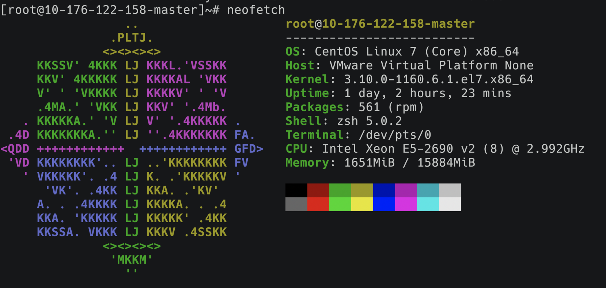
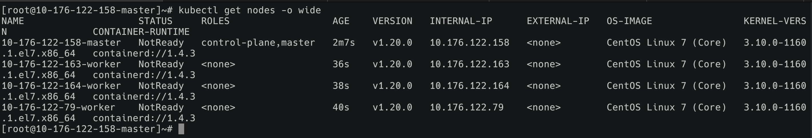

# 使用Kubernetes V1.20.0 与 Containerd 配置K8s集群

## 写在前面

Kubernetes在最新的1.20.0版本中表示正式放弃了Docker，原来的Docker项目也早已改名为Moby了，即便Docker在容器技术中仍占据主流，并且在其他地方也能够继续发光发热，但从长远来看，容器运行时必然也会进入一个多方竞争的时代。对于适配了Kubernetes CRI的容器运行时，我们便有了很多选择，如Containerd和CRI-O。Docker目前占据了约七成的份额，而第二名Containerd也占据了两成多。刚好实验室有搭建集群的需求，作为爱折腾星人，决定紧跟时代，用最新的V1.20.0的Kubernetes与Containerd来搭建我们的实验集群。我会简单讲解我的配置过程以及中间遇到的问题及解决方法，毕竟自己踩过的坑，得讲一遍才能记得深刻（笑）

本文所需shell脚本都在这个[repo](https://github.com/kagaya85/K8sTakeOff)，如果之后有需要也会不断更新，对于配置过程中产生的问题欢迎在issue中讨论。

## 配置基本环境

这次打算在四台裸机上部署一个单master节点，三个worker节点的小集群，单机配置如下：



当然这是我部署好后的截图，主机的名称也改为了ip+nodeType，方便识别当前主机，当然这也是必须修改的，因为原来的四台主机的主机名都为localhost.localdomain，同名主机在建立集群后不能一起显示，这也是配置时遇到的坑之一，所以我也同样将改名的命令分别写在了`04_pull_master_images.sh`与`04_pull_worker_images.sh`，可以自动实现将主机名替换为ip+nodeType，当然，这都是后话了。

本次主要是在CentOS7下进行配置，要求能连接外网，对于kubernets需要的k8s.gcr.io上的镜像我也已经在阿里云上同步了一份，所以没有挂代理的要求。当然最好还是在root用户下执行，不保证非root用户的执行效果（可增加sudo尝试）

对于每一台机器，只需要一次执行00～02对应脚本

```bash
# cd进入脚本对应目录
bash 00_install_tools.sh
bash 01_config_env.sh
bash 02_install_kube.sh
```

* 00安装了一些必要的工具，如git、vim、unzip、ntpdate等，安装了yum epel并对yum进行了换源。除此之外，还包含一些常用的工具如zsh、neofetch、htop等，同时也会将shell切换为zsh（⚠️注意，后文的脚本都是基于修改`~/.zshrc`文件，如果不使用zsh，请对应修改为`~/.bashrc`或`~./bash_profile`），这里可以根据自己的需要做修改。

* 01设置了一些基本环境配置，关闭firewalld和swap，设置了iptable转发等，特别是对时间进行同步，并修改为CST时区，保证各个主机上时间的一致性对集群的配置也至关重要。
* 02为yum添加了Kubernetes的repo，安装了1.20.0版本的kubelet、kubeadm、kubectl三件套

## 安装Containerd

接下来，我们为每一台主机安装Containerd替换之前的Docker。

一键安装：

```bash
bash 03_install_containerd.sh
```

Containerd的官方quick-start文档会默认你已经安装了runc（Containerd默认的容器运行工具），所以第一步我们还是要安装runc，否则将无法运行容器。

我们直接选择拉取runc的官方仓库进行编译安装，runc比较小，编译很快，但是需要有go的运行环境和`libseccomp` 、`libseccomp-devel`两个链接库，可以参考[这里](https://github.com/containerd/containerd/blob/master/BUILDING.md#build-runc)。这些都在脚本中安装好了，如果你不想编译，也可以下载编译好的二进制文件放到`$PATH`对应的目录中即可。

```bash
# install runc
git clone https://github.com/opencontainers/runc
cd runc &&
  make &&
  make install
```

这样就安装好了runc工具

安装Containerd也很简单，直接下载官方编译好的二进制压缩包，解压对应目录，这里我也选择了较新的1.4.3版本，甚至官方仓库的release tag里还是1.3.9版本

```bash
CONTAINERD_VERSION=1.4.3
wget https://github.com/containerd/containerd/releases/download/v"$CONTAINERD_VERSION"/containerd-"$CONTAINERD_VERSION"-linux-amd64.tar.gz
tar -xvf containerd-"$CONTAINERD_VERSION"-linux-amd64.tar.gz -C /usr/local/
```

接下来就是比较关键也是我当时遇到问题最多的地方：containerd配置

一般来说，containerd提供了生成默认配置的方法

```bash
# 需提前创建对应目录 
# sudo mkdir -p /etc/containerd/
containerd config default >/etc/containerd/config.toml
```

但是这样会有**一些问题**：

* 之后在使用crictl工具连接containerd工具时会报错：

  ```
  unknown service runtime.v1alpha2.ImageService &Unimplemented desc = unknown service api.v1.CRIPluginService
  ```

  可参考这个[issue](https://github.com/kubernetes-sigs/cri-tools/issues/436#issuecomment-464290289)，对应的解决方法就是修改以下配置

  ```toml
  [plugins."io.containerd.grpc.v1.cri".containerd]
  	snapshotter = "overlayfs" --> "native"
  	default_runtime_name = "runc"
  	no_pivot = false
  ```

* 后面在使用`kubeadm init`初始化集群时，在启动apiserver等pod时，会报错：

  ```
          Unfortunately, an error has occurred:
                  timed out waiting for the condition
  
          This error is likely caused by:
                  - The kubelet is not running
                  - The kubelet is unhealthy due to a misconfiguration of the node in some way (required cgroups disabled)
  
          If you are on a systemd-powered system, you can try to troubleshoot the error with the following commands:
                  - 'systemctl status kubelet'
                  - 'journalctl -xeu kubelet'
  
          Additionally, a control plane component may have crashed or exited when started by the container runtime.
          To troubleshoot, list all containers using your preferred container runtimes CLI.
  
          Here is one example how you may list all Kubernetes containers running in cri-o/containerd using crictl:
                  - 'crictl --runtime-endpoint /run/containerd/containerd.sock ps -a | grep kube | grep -v pause'
                  Once you have found the failing container, you can inspect its logs with:
                  - 'crictl --runtime-endpoint /run/containerd/containerd.sock logs CONTAINERID'
  
  couldn't initialize a Kubernetes cluster
  ```

  使用`systemctl status kubelet`查看kubelet情况，可以看到kubelet有在运行但是日志里一直打印`node "localhost.localdomain" not found`

  ```
  ● kubelet.service - kubelet: The Kubernetes Node Agent
     Loaded: loaded (/usr/lib/systemd/system/kubelet.service; enabled; vendor preset: disabled)
    Drop-In: /usr/lib/systemd/system/kubelet.service.d
             └─10-kubeadm.conf
     Active: active (running) since Thu 2020-12-17 20:48:18 CST; 6min ago
       Docs: https://kubernetes.io/docs/
   Main PID: 10688 (kubelet)
      Tasks: 18
     Memory: 37.6M
     CGroup: /system.slice/kubelet.service
             └─10688 /usr/bin/kubelet --bootstrap-kubeconfig=/etc/kubernetes/bootstrap-kubelet.conf --kubeconfig=/etc/kubernetes/kubelet.conf ...
  
  Dec 17 20:54:35 localhost.localdomain kubelet[10688]: E1217 07:54:35.161585   10688 kubelet.go:2240] node "localhost.localdomain" not found
  Dec 17 20:54:35 localhost.localdomain kubelet[10688]: E1217 07:54:35.261944   10688 kubelet.go:2240] node "localhost.localdomain" not found
  Dec 17 20:54:35 localhost.localdomain kubelet[10688]: E1217 07:54:35.362297   10688 kubelet.go:2240] node "localhost.localdomain" not found
  Dec 17 20:54:35 localhost.localdomain kubelet[10688]: E1217 07:54:35.462629   10688 kubelet.go:2240] node "localhost.localdomain" not found
  Dec 17 20:54:35 localhost.localdomain kubelet[10688]: E1217 07:54:35.562916   10688 kubelet.go:2240] node "localhost.localdomain" not found
  Dec 17 20:54:35 localhost.localdomain kubelet[10688]: E1217 07:54:35.663161   10688 kubelet.go:2240] node "localhost.localdomain" not found
  Dec 17 20:54:35 localhost.localdomain kubelet[10688]: E1217 07:54:35.763546   10688 kubelet.go:2240] node "localhost.localdomain" not found
  Dec 17 20:54:35 localhost.localdomain kubelet[10688]: E1217 07:54:35.863925   10688 kubelet.go:2240] node "localhost.localdomain" not found
  Dec 17 20:54:35 localhost.localdomain kubelet[10688]: E1217 07:54:35.964162   10688 kubelet.go:2240] node "localhost.localdomain" not found
  Dec 17 20:54:36 localhost.localdomain kubelet[10688]: E1217 07:54:36.064368   10688 kubelet.go:2240] node "localhost.localdomain" not found
  ```

  这里的日志不够详细，于是我又使用`journalctl -xeu kubelet`查看更详细的日志，日志数量比较多，很容易漏掉关键的错误，比如说下面这条报错是我在重试了多次后才在日志中发现的：

  ```
  CreatePodSandbox for pod "kube-scheduler-localhost.localdomain_kube-system(a28385ea64639c19ce25476016scheduler-localhost.localdomain_kube-system(a28385ea64639c19ce254760161b1d3b)" failed: rpc error: code = Unknown desc = failed to get sandboxb1d3b)" failed: rpc error: code = Unknown desc = failed to get sandbox image "k8s.gcr.io/pause:3.1": failed to pull image "k8s.gcr.io/pause:3.1": failed to pull image "k8s.gcr.io/pause:3.1": failed to pull and unpack image "k8s.gcr.io/pause:3.1":
  ```

  可以看到中的关键信息`failed to pull image "k8s.gcr.io/pause:3.1"`，也就是说kubelet创建pod时卡在了拉取pause镜像这一步，当时在初始化kubeadm之前，我已经在本地准备好了所有所需要的镜像，并且kubeadm通过指定镜像仓库的参数`--image-repository=${IMAGE_REPOSITORY}`已经将kubelet所要拉取镜像的目标仓库切换为阿里云的仓库，但这里还是去从一个不存在的谷歌容器仓库k8s.gcr.io拉取镜像，导致我在这里一度怀疑是kubelet的配置问题。

  直到我翻到了kubeadm的[issue#2020](https://github.com/kubernetes/kubeadm/issues/2020)中提到了kubeadm并不会配置pause image的repository，以及在containerd的[issue#813](https://github.com/containerd/cri/issues/813)，提到了**pause镜像的仓库及版本是写在containerd的配置文件中**，所以，只需要在`config.toml`中修改以下配置

  ```toml
  [plugins."io.containerd.grpc.v1.cri"]
    disable_tcp_service = true
    stream_server_address = "127.0.0.1"
    stream_server_port = "0"
    stream_idle_timeout = "4h0m0s"
    enable_selinux = false
    sandbox_image = "k8s.gcr.io/pause:3.1" --> "registry.cn-hangzhou.aliyuncs.com/kagaya/pause:3.2"
  ```

  以上问题就解决了:-(

所以，配置脚本中直接生成了修改好的配置文件，使用脚本就不会遇到以上问题了

## 安装Kubernetes并创建集群

以上的操作是需要在每一台主机进行配置，接下来的操作可能会有Master与Worker主机的区别，请注意。

这里先使用上一步配置好的crictl工具拉取镜像为创建集群时节省时间

* 准备Master节点镜像

  执行以下脚本

  ```bash
  bash 04_pull_master_images.sh
  ```

* 准备Worker节点镜像

  ```bash
  bash 04_pull_worker_images.sh
  ```

* 以上两步会以ip+nodeType的格式同时修改Master和Worker节点的主机名，原因写在了文章开头

* 初始化Master节点

  ```bash
  bash 05_init_master.sh
  ```

  这一步会在kubeadm中指定kubernetes的版本，CIDR范围，镜像仓库等，如果顺利的话，你可以看到最后打印的其他节点join集群的方法，类似这样：

  ```
  kubeadm join 192.168.0.170:6443 --token r7w69v.3e1nweyk81h5zj6y \
      --discovery-token-ca-cert-hash sha256:1234a2317d27f0a4c6bcf5f284416a2fb3e8f3bd61aa88bc279a4f6ef18e09a1 
  ```

  之后需要手动在**各个Worker节点**上执行一下这条命令加入Master所在集群，请务必确保各节点时间同步，因为token的合法性会用时间去验证。

* 如果需要，你还可以使用`05_init_worker_kubectl.sh`来初始化Worker节点上的kubectl命令

如果以上步骤顺利的话，你现在可以在Master节点上使用`kubectl get nodes -o wide`看到各个节点的信息，当然Status为NotReady是因为我们还没有执行最后一步，安装calico网络



## 安装Calico网络

这一步就比较简单了，只需要在每个Node上都从Dockerhub上拉取对应的镜像，然后从**Master节点**上用kubectl应用yaml文件。

一键脚本：

```bash
bash 06_install_calico.sh
```

这里也选用了较新的Calico v3.17.1

```bash
CALICO_VERSION=v3.17.1

crictl pull calico/cni:$CALICO_VERSION
crictl pull calico/pod2daemon-flexvol:$CALICO_VERSION
crictl pull calico/node:$CALICO_VERSION
crictl pull calico/kube-controllers:$CALICO_VERSION
```

默认的yaml文件来自官方的3.17版本，我也在manifests目录下准备了离线版本

```bash
CALICO_YAML="https://docs.projectcalico.org/v3.17/manifests/calico.yaml"
# CALICO_YAML="./manifests/calico.yaml"
```

kubernetes会在各个节点上使用DaemonSet的方式运行calico pod，这样各个节点的pod就可以通过虚拟网络进行通信了。

## 最后说几句

以上就基本完成了K8s集群的搭建，如果需要，还可以安装metrics server以提供各个节点的Cpu与Mem资源信息

```bash
bash 07_install_metrics_server.sh
```

当然，文中所提到的问题并不是全部，其他诸如安装metric server时的错误：

```
metric-server : TLS handshake error from 20.99.219.64:57467: EOF
```

需要通过修改metric server deployment的启动参数解决

```yaml
- args:
    - --kubelet-insecure-tls
    - --kubelet-preferred-address-types=InternalIP,ExternalIP,Hostname
```

如果有其他问题，也欢迎在[这里](https://github.com/kagaya85/K8sTakeOff/issues)提交issue交流。


最后：

**Kill Docker And Long Live Kubernetes!!!**