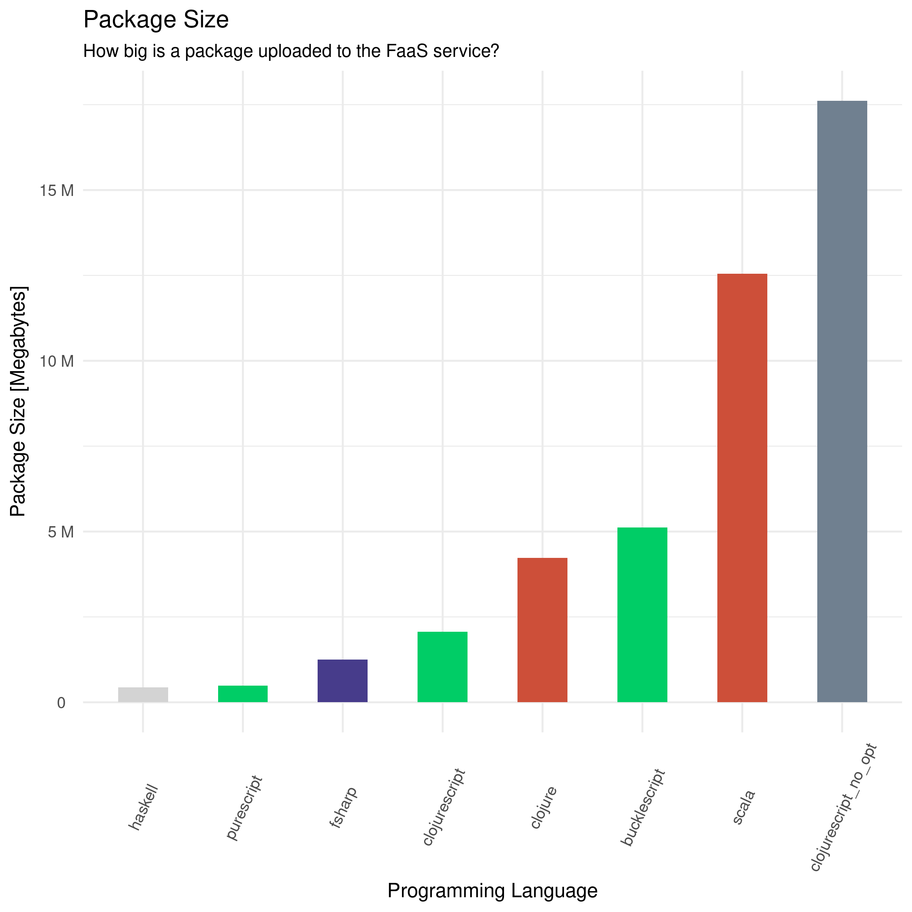
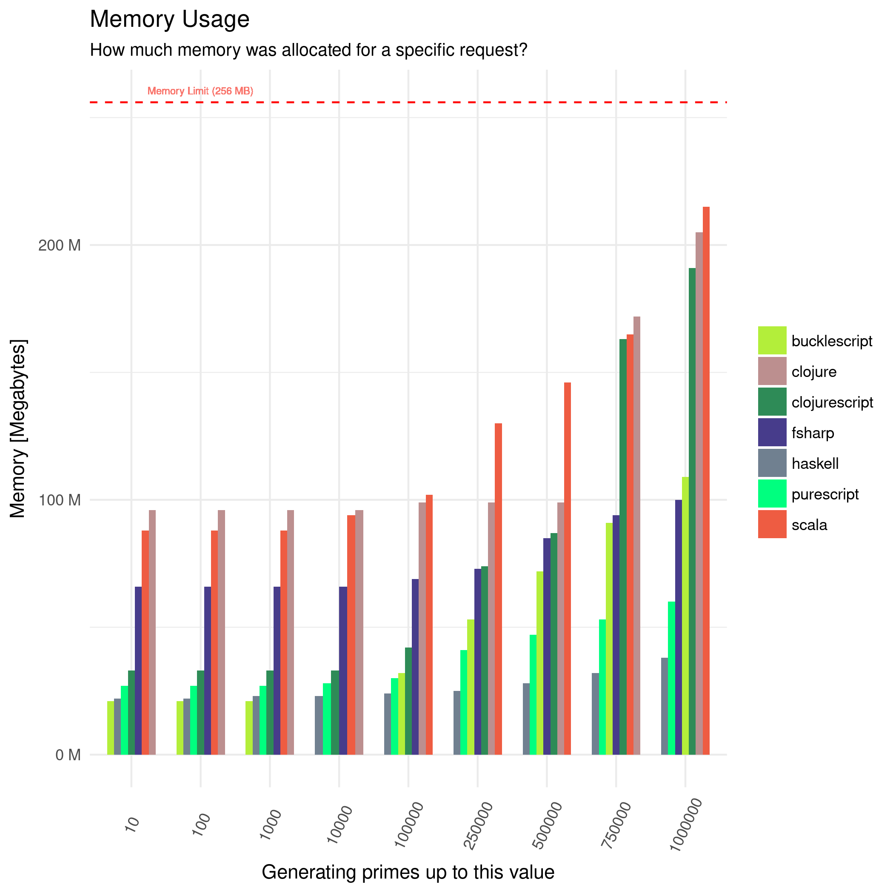
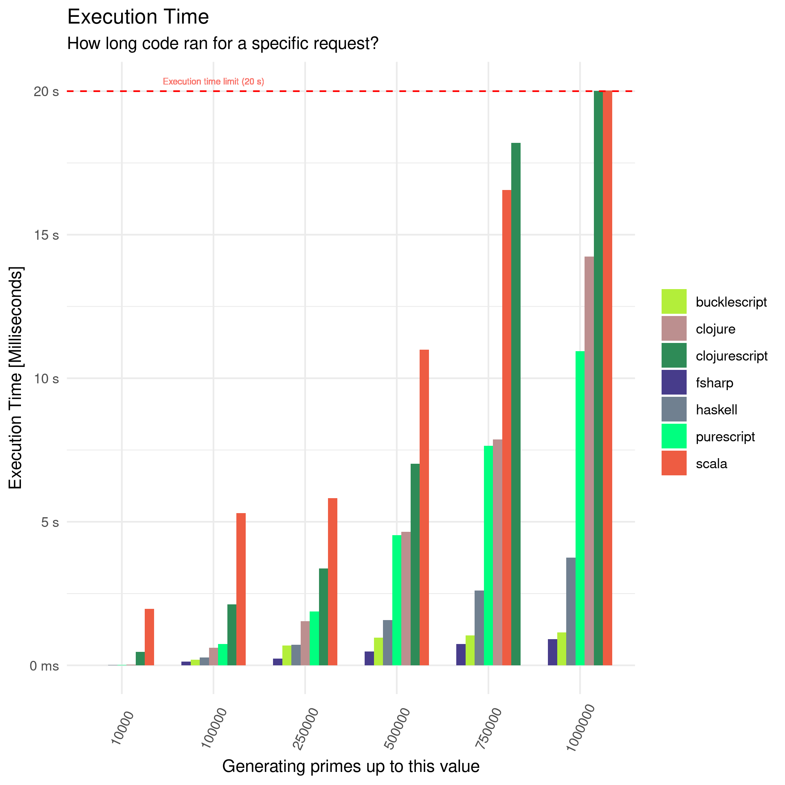
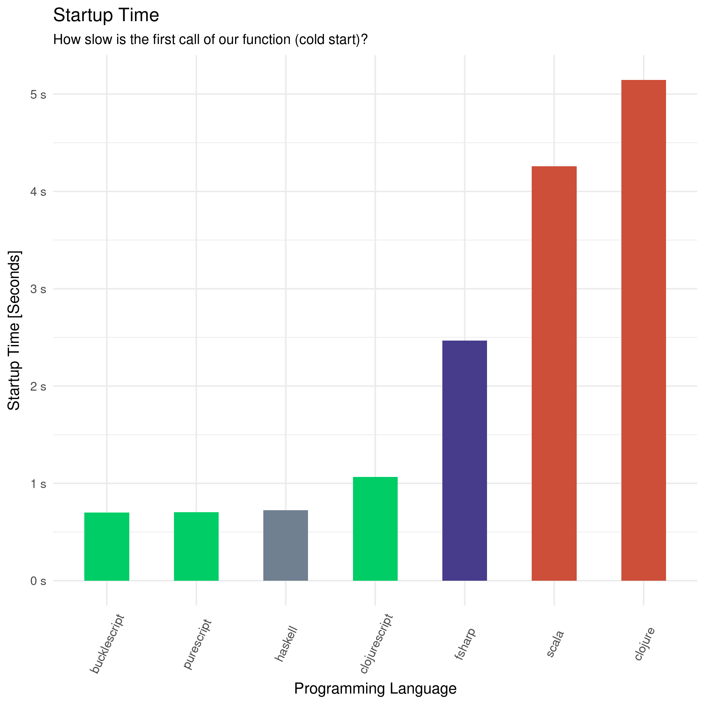

## 简介

函数式编程（英语：functional programming）或称函数程序设计、泛函编程，在Wiki中是这么定义的：一种编程范式，它将电脑运算视为函数运算，并且避免使用程序状态以及易变对象[^HanShuShiBianCheng2020]。比起指令式编程，函数式编程更加强调程序执行的结果而非执行的过程，倡导利用若干简单的执行单元让计算结果不断渐进，逐层推导复杂的运算，而不是设计一个复杂的执行过程。 

尽管函数式编程已经诞生了很久的时间，但是随着分布式并行计算的兴起，函数式编程独特的设计逻辑以及自诞生之初所具备的特性往往会给我们一种新的视角来看待程序设计。每当我在使用函数式的思维来编写代码时，往往感觉自己就像在做数学计算，在代码中撰写一行行公式，给编程带来一种独特的体验。

当函数成为编程语言中的一等公民（first class citizen）时，给我们的编程思维都会带来很大的影响。当然，这会带来一些显而易见的好处，但是如同其他新技术一样，函数式的方法也存在一定的局限性。本文会以Haskell和Go两种语言为例，从函数式语言的发展讲起，紧接着讲述函数式语言在一些领域的应用（如近几年火热的Cloud Native），最后总结了目前人们对于函数式语言的优越性与局限性的看法。从以上三个方面阐释函数式程序设计的影戏那个与应用

## 函数式语言的发展

### Haskell

Haskell是一种标准化的，通用的纯函数式编程语言，有惰性求值和强静态类型。它的命名源自美国逻辑学家哈斯凯尔·加里，他在数理逻辑方面上的工作使得函数式编程语言有了广泛的基础。在Haskell中，“函数是第一类对象”。作为一门函数编程语言，主要控制结构是函数。Haskell语言是1990年在编程语言Miranda的基础上标准化的，并且以λ演算为基础发展而来[^Haskell2020]。

与命令式编程语言不同，Haskell是一种纯函数式编程语言。虽然它现在仍然局限在学术界和需要大量使用高等数学的行业如金融业，但是这并不意味着数值计算。

功能编程范式依赖于编程功能 ，其行为为数学函数，允许创建不修改外部数据或具有与外部上下文的可观察的交互功能。可观察的交互是指将数据写入文件或引发异常的事情。在技术上这意味着功能没有 side-effects，这也可能成为一等公民的功能。函数和其他类型一样，也可以作为其他函数的参数。

### FP in Golang

Go语言是Google开发的一种静态强类型、编译型、并发型，并具有垃圾回收功能的编程语言。Robert Griesemer、Rob Pike及肯·汤普逊于2007年9月开始设计Go，稍后Ian Lance Taylor、Russ Cox加入项目。Go是基于Inferno操作系统所开发的。Go于2009年11月正式宣布推出，成为开放源代码项目，支持Linux、macOS、Windows等操作系统。

尽管Go不是专门设计的函数式编程语言，但其语法支持我们使用一些函数式的编程思维。只需要满足两个规则：

* 没有数据赋值：数据对象赋值后不再改变
* 没有隐藏状态：隐藏在内部的状态在设计的使用就应该被避免。对于函数式编程来说，状态没有消失，而是变得明确而且可见。

当我们在Go中使用了函数式的设计思维，意味着：

* No side-effect：函数和操作不应该在其函数范围外更改任何变量，函数应该将值返回给调用方，并且不影响任何外部状态，程序也更容易被理解，从而无需担心任何的“副作用”。
* 使用纯函数：函数应该是是幂等的，同样的入参只会得到相同的结果。一个函数的返回值应该只基于输入参数而没有任何的side-effect或依赖任何的全局变量。
* Clean Code[^GeisonFunctionalGo2020]：因为函数没有隐藏的状态，可以更好的理解方法、函数、类、以及整个项目。

在Golang中，可以通过7种方法来实现函数式的编程[^deepuEasyfunctionalprogramming2019]，其中包含像高阶函数、柯里化、闭包函数、纯函数等语法在Go语言中都是支持的。

```go
// this is a higher-order-function that returns a function
func add(x int) func(y int) int {
	// A function is returned here as closure
	// variable x is obtained from the outer scope of this method and memorized in the closure
	return func(y int) int {
		return x + y
	}
}

func main() {

	// we are currying the add method to create more variations
	var add10 = add(10)
	var add20 = add(20)
	var add30 = add(30)

	fmt.Println(add10(5)) // 15
	fmt.Println(add20(5)) // 25
	fmt.Println(add30(5)) // 35
}
```

但是对于函数式编程中常用的递归调用来说，由于Go语言的编译器不支持对尾递归的调用优化，只能采用纯递归的方式，导致在递归时需要考虑调用堆栈的大小，因此在编写递归程序的时候我们不得不考虑递归的调用深度，或者改写为迭代方式，防止内存爆栈导致的程序异常。

Golang一般使用了strict/eager的计算方式（除了`&&`和`||`运算符），这种方式与函数式所推崇的延迟求值相反，会在调用时立即计算出对应的结果，对于延迟求值来说，我们可以使用一些方法来模拟，像是高阶函数的方式，也可以利用Go语言中的一些特性，如sync包和channel结构来进行模拟。

一个高阶函数模拟的延迟求值方法，通过传入函数名而不是传入函数的调用，避免在传参时就计算出结果，而是在函数最后return后才计算对应的结果：

```go
func add(x int) int {
	fmt.Println("executing add")
	return x + x
}

func multiply(x int) int {
	fmt.Println("executing multiply")
	return x * x
}

func main() {
	fmt.Println(addOrMultiply(true, add, multiply, 4))
	fmt.Println(addOrMultiply(false, add, multiply, 4))
}

// This is now a higher-order-function hence evaluation of the functions are delayed in if-else
func addOrMultiply(add bool, onAdd, onMultiply func(t int) int, t int) int {
	if add {
		return onAdd(t)
	}
	return onMultiply(t)
}
```

最后，是关于函数式程序设计中的应用透明性：

> Functional programs do not have assignment statements, that is, the value of a variable in a functional program never changes once defined. This eliminates any chances of side effects because any variable can be replaced with its actual value at any point of execution. So, functional programs are referentially transparent.

Go语言中实现引用透明的方法是通过避免引用传递或指针传递的使用。虽然在Go语言中都是通过值传递的方式来传递参数，但是像切片或者Map这样的数据结构是通过指针的方式来进行传递。因此我们在使用函数式的程序设计思路来构造我们的程序时，应当注意引用透明性，避免在函数的计算结果受外部的状态影响或者影响外部的状态。

对于Go语言来说，由函数式所带来的引用透明性可以带来很多显而易见的好处，比如我们可以缓存每一次函数调用的结果来达到空间换时间的目的，又或者幂等的函数使得函数的计算结构变得可预测。同时函数式天生的模块化设计理念可以让自底向上的程序设计变得更加容易。程序的调试也变得更加简单，由于函数都是各自独立的，他们的计算结果只依赖于各自的输入参数。

最后一点也是十分重要的，由于Go语言设计之初是为了更好的支持高并发场景，而函数式设计的方法天生就支持并发运行的场景，因为这些方法不需要共享数据，无信号量、无监控、无锁、从而也不会导致竞争危害和死锁的发生[^GeisonFunctionalGo2020]，与Go语言的高并发设计理念不谋而合。

## 函数式语言的应用

### FP in Compiler

在Go语言的编译器在生成中间代码（IR）时，采用了静态单赋值的特性（Static Single Assignment form、通常简写为SSA form或是SSA），如果中间代码具有静态单赋值的特性，那么每个变量就只会被赋值一次。尽管某些代码在循环中执行了很多次，但是单赋值只表示程序文本的静态属性而不是执行的动态属性。

将程式码转换为SSA形式，最简单的方法，就是将每个被赋值的变数，以一个新的变数来取代，而新的变数名称则为一个带着编号的旧变数。SSA通过加一个特别的描述，称之为*Φ 函式*，来实现对于变量赋值来源不确定时的表示[^JingTaiDanFuZhiXingShi2020]。

在《SSA is Functional Programming》[^AppelSSAfunctionalprogramming1998]这篇文章中，作者提出了一种观点，认为SSA form其实是一种函数式编程，对于一次赋值，左侧是对应函数的形式参数，右侧是对应函数调用的实际参数。通过函数之间的嵌套调用，可以很清楚的表现SSA中的变量的实际作用范围。

因此，对于SSA来说，SSA form的一个重要属性是，变量的定义决定了每次的使用（或在C函数中使用的情况下，支配使用节点的前驱节点）。 SSA的解释中通常未声明此属性，但是对SSA进行许多分析和优化是必需的-它是SSA语义的一部分。 在具有嵌套作用域的函数式程序中，此限制已明确且静态地编码到函数嵌套的结构中。 变量范围的概念有助于我们构造中间形式。

而对于使用函数式程序设计的成语言来说，使用SSA的过程中，往往会绘制带有方框，任务，条件和控制流边缘的流程图。 这种表示法虽然容易被滥用，但通常更适合于解释思想以及直观地可视化地表现算法和状态转换。 函数式程序员可以借鉴这样一种方法，避免迷失在函数式编程的概念中。

### FP in Parallel Programming

为了提高计算机的运行速度和系统的处理能力，在总体设计和逻辑设计中广泛采用并行操作技术，使各部件并行工作。要求操作系统具有并发性及资源共享，可以采用并行程序设计的方法。

对于命令式的语言来说，进行并行程序设计时会遇到许多困难[^PeytonJonesParallelImplementationsFunctional1989]：

- 程序员必须构思一个符合规范的并行算法
- 程序员需要将算法映射到编程语言提供的抽象上：
    - 需要标识一定数量的顺序活动，成为可以被并行执行的任务或者进程
    - 在任务之间定义接口，使之能够安全的进行数据同步和通信
    - 任务之间任何的数据共享都需要程序员进行特殊保护
- 在某些系统中，程序员还需要负责将任务映射到对应处理器上，并确保可以和任何执行该任务的处理器进行通信
- 程序员往往不能干涉具体的调度细节，这样导致无法确定处理器下一步会执行哪一个任务，因此程序员还需要保证任务集不会产生死锁等问题

而与之相对比的函数式编程语言来说，对于解决并行程序设计有着先天的优势[^PeytonJonesParallelImplementationsFunctional1989]：

- 不需要新的语言构造来表达并行性，或者并发任务之间的同步和通信。并发是完全隐式的，如果计算机有空间和容量执行任务，那么就会动态的产生新任务
- 无需采用特殊措施来保护并发任务的共享数据
- 相比顺序编程，并发的函数式编程并不会让程序功能变得复杂。因为都使用相同的技术，也没有新的结构被添加进来。
- 程序结果是确定的，也就是说，额外的的因素例如调度策略并不会使得每一次执行的结果不同

并行函数式编程是一种处于青春期的技术。它的潜力是巨大的，但是在它获得广泛信誉之前，需要在实际应用中进行实践测试。幸运的是，现在可以实现支持实际应用程序的实现，并且可以预期，在未来几年中，使用函数式编程的使用将大大增加。使函数式程序具有吸引力的原因正是那些对分布式计算系统和运行时资源管理系统的大量需求。但是，随着实现的改进，函数式编程的成本应变得越来越可忽略。随着软件变得越来越复杂，其收益将越来越有价值。

### FP in Cloud

云原生是一种构建和运行应用程序的方法，是一套技术体系和方法论。云原生（CloudNative）是一个组合词，Cloud+Native。Cloud表示应用程序位于云中，而不是传统的数据中心；Native表示应用程序从设计之初即考虑到云的环境，原生为云而设计，在云上以最佳姿势运行，充分利用和发挥云平台的弹性+分布式优势。可以简单的将云原生理解为：**云原生 = 微服务 + DevOps + 持续交付 + 容器化**

#### 性能场景

云原生技术中最有具有代表性的技术之一，便是无服务Serverless技术。在Serverless中，不仅对基础设施进行了虚拟化，抽象化管理，而且可以按需启动和支付需要的资源（CPU、memory、网络带宽）。这样人们可以只考虑架构解决方案而不用去担心潜在的基础设施配置、供应、伸缩或管理[^HargreavescaseFunctionalProgramming2018]。

在《Functional Programming in Serverless World》[^GawronskiFunctionalProgrammingServerless2018]中，作者利用AWS的Lambda Serverless服务对几种函数式语言在Serverless场景中的性能进行了测试，作者主要做了四个方面的测试：

- 包大小
- 内存占用
- 执行效率
- 冷启动时间

结果如下：

 

 

从这些测试中可以看出，不同的函数式语言在无服务器场景下运行情况是又较大的区别的。作者认为，对于Serverless技术不应该盲目的使用，而是更具应用场景再决定是否使用Serverless。同时，作者还建议，对于一个Serverless服务，最可靠安全的函数式语言应该是F#，因为由于各个云服务提供的Serverless服务所支持的语言不同，但对于.NET Core平台的支持都是最充足的。

#### 云原生应用场景

在《Functional Programming Languages in Computing Clouds》[^FritschFunctionalprogramminglanguages2016]这篇文章中，作者对于云计算场景下的函数式程序设计语言提出了两个问题：

- 云计算构建中有哪些新的范式和问题？
- 函数式编程语言（FPL）是否适合这些范式，它们是否提供新的方法来应对新的问题和挑战？

作者着重讨论的Haskell语言在云计算场景下的表现，发现Haskell非常适合不需要在物理（或虚拟）系统的边界上分布应用程序的使用场景，但却不适用于需要与应用程序进行通信的基于分布式云的工作负载的开发，特别是分布式工作负载的协调。 

但随着一些在分布式环境中容纳不确定性的机制发展，从而使应用程序具有一定的抗脆弱性，Haskell在未来可能有资格成为合适的工具，而不是坚持严格的确定性，使得Haskell应用程序只能可以在本地系统上或通过阻塞的通信机制来保证确定性。Haskell的并行化功能是为单个系统设计的，因此未来的方向可能有一下几点：

- 在分布式环境中使用轻便且健壮的通信协议
- 研究功能与第三方通信服务的集成（如etcd）
- 研究FPL在Serverless计算和IoT（那些现在没有使用FPL）中的潜在作用

同时，作者也讨论了Serverless技术带来的影响：Serverless计算与IoT通常不需要节点间的消息传递和协调，往往比起云计算更适合用函数式编程语言来实现。

Serverless技术中的代表，AWS Lambda，是一个运行代码的完全托管环境，通过将代码部署在lambda函数中，从受支持的AWS服务之一接受事件时触发我们的代码，并将事件作为参数传递。而函数式设计的程序，是将程序定义问函数，AWS Lambda提供了一个方便的抽象赖于其他的AWS服务进行交互，所有的一切都是我们作为参数接受的事件。通过函数组合的方式解决原来函数过于庞大复杂难以维护的问题，各个功能拆分为较小的函数，然后通过组合的方式实现最终的功能。遵循这种方法的优点是我们可以以可重用的方式考虑我们较小的功能。 然后，我们可以像将它们与积木一起玩时那样将它们放在一起。

比如说，对于一个验证函数[^MocchettiUsingFunctionalProgramming]，为了通过验证，我们需要做很多项不同的检查：

```javascript
const queryParamsIsNull = (event: APIGatewayEvent) => {
	if (event.queryStringParameters !== null) {
		throw new ApplicationError(
			'Error parsing request query params',
			['Query params should be empty'],
			StatusCodes.BAD_REQUEST
		);
	}
	return event;
};
const pathParamsIsNull = (event: APIGatewayEvent) => {
	if (event.pathParameters !== null) {
		throw new ApplicationError(
			'Error parsing request path params',
			['Path params should be empty'],
			StatusCodes.BAD_REQUEST
		);
	}
	return event;
};
const asUserPostEvent = (event: APIGatewayEvent) => {
	try {
		const parsedBody = event.body
			? JSON.parse(event.body)
			: {};
		return {
			...event,
			body: parsedBody
		};
	} catch (error) {
		throw new ApplicationError(
			'Error parsing request body',
			['Invalid JSON'],
			StatusCodes.BAD_REQUEST
		);
	}
};
```

通过函数组合的方式，我们可以很方便的决定需要做哪些检查项：

```javascript
const validateCreatePostEvent = compose(asUserPostEvent, queryParamsIsNull, pathParamsIsNull);
```

#### 分布式系统开发

在另一片文章《Using Functional Programming for Development of Distributed, Cloud and Web Applications in F#》[^SoshnikovUsingFunctionalProgramming2015]，作者讨论了分布式环境下对于函数式编程语言F#的使用。

分布式系统的开发本质上非常复杂，部分原因是在客户端和服务器端使用了不同的语言和技术，而且这些技术之间通常没有透明的无缝集成。 因此，开发人员必须将整个系统视为许多互操作的模块，始终牢记这些模块如何协同工作并交换信息。 这也使开发更加复杂，因为我们需要在源代码树中分离服务器端和客户端代码。

作者强调了F＃非常适合于分布式云计算。 由于函数样式迫使我们以一种由无状态函数组成的方式分解问题，无状态函数仅在给定初始数据的情况下计算结果，因此我们自然可以在集群中的不同节点上并行运行那些独立的函数。 任务的分配仍然是开发人员的责任，但是功能分解过程的整体性质使其变得更加容易。

### FP in Programming Design: Optional Functions

在使用面向对象的方法编写程序的过程中，我们往往会遇到一些配置相关的问题，比如如果我们要启动一个服务器，需要为这个服务器配置各种参数，类似这样

```go
type Server struct {  
    Addr string  
    Port int  
    Protocol string 
    Timeout time.Duration 
    MaxConns int
    TLS *tls.Config 
}
```
而往往我们不需要配置所有的参数，希望某些配置项使用默认的参数。OOP的语言中我们一般可以使用函数重载的方式解决这一问题。但是在对于先Golang这种不支持函数重载的语言，则需要定义许多构造函数，通过带不同形式参数的方式来应对不同的配置需求，又或者通过一个自定义的配置结构体，将配置项打包为一个数据结构整体传入。这样的方法虽然可以解决问题，但是从程序设计和程序可读性的角度来说，上面的做法既不高效，也不具有很好的可读性。

前贝尔实验室成员，UTF-8与Golang的创始人之一Rob Pike曾在2014年的一篇博文《Self-referential functions and the design of options》[^PikecommandcenterSelfreferential2014]中，用函数式编程的的思想巧妙的提出了一种解决程序设计中进行对象参数设置的方法，展现了函数式编程在与面向对象编程中结合的魅力。

Rob Pike同样遇到了这样的问题，在他与社区的成员进行讨论后，总结并提出了Optional Function（配置函数）的方法，非常巧妙的解决了自定义配置的同时，也让代码有了自解释性，大大提高了代码的可读性。

什么是Optional Functional，首先我们会定义一种新类型：
```go
type option func(*Server)
```
我们将一个入参为对象指针，无返回值的函数定义为类型`option`，紧接着，我们可以在对象中定义一个用于设置参数的函数Option
```go
// Option sets the options specified.  
func (s *Server) Option(opts ...option) {  
    for _, opt := range opts {  
    opt(s)  
    }  
}
```

最后，我们可以定义某一个配置项的设置函数，与以往OOP中的set函数不同的是，这个函数接受一个我们想要设置的数值，返回的却是一个Option函数

```go
// Verbosity sets Foo's verbosity level to v.
func Verbosity(v int) option {
    return func(s *Server) {
        s.verbosity = v
    }
}
```

这样，我们就可以通过类似下面这样的方式来方便的设置我们需要的自定义配置项，在不破坏对象封装的情况下也可以通过函数名让配置方法具有来很好的可读性:

```go
server.Option(Verbosity(3), Overtime(10), Addr("192.168.10.1"), Port(80))
```

当然，还有一些**进阶**的用法，比如将Option的定义修改为

```go
// 返回一个值
type option func(*Foo) interface{}

// 返回option函数
type option func(*Foo) option
```

第一种方式我们可以通过返回的`interface{}`获取修改之前的配置值，第二种方法则可以返回一个包含了原始值的Option函数，通过调用该Option函数，我们可以直接将配置项恢复为原始值。结合Golang中的`defer`函数，便可以方便的实现对于配置项的临时修改和恢复。

## Pros and Cons of FP

正如任何技术方法一样，在新技术刚刚出现时总会受到人们的热情追捧，但是随着时间的推移，慢慢人们也会发现许多问题。函数式程序设计方法也是如此，对程序员来说，函数式编程为我们程序设计带来的新的方法和思维，这些往往给一些软件设计中的难点和痛点提供了新的解决方法。同样函数式编程不是银色子弹，它也有许多自己的局限性，我们应该辩证地去看待它对程序设计的影响。接下来，我会从正面和反面两个角度总结如今人们是如何看待函数式程序设计的，以及FP所具有的优越性和局限性。

### Advantages

函数式编程的有点是非常显而易见的，从不同角度来说，函数式程序设计的优越性往往有以下几个方面：

* 函数式程序设计是非常安全的，尤其是在并行和分布式编程中，因为纯函数是天生线程安全的[^FunctionalProgrammingNot]
* 纯函数容易理解，不需要关注任何可能被改变的隐藏状态。这使得代码更短，从而保证可以容忍的错误数量更少[^Findoutpros2018]
* 函数式编程完成的程序往往更加容易测试，因为它不需要去模拟和考虑任何的Side-effect[^FunctionalProgrammingNot]
* 同时函数式使得人们更容易区分哪些函数是不纯的，因此在QA阶段可以将大部分测试资源都集中在这里，从而提高程序的可靠性[^FunctionalProgrammingNot]
* 函数式的方法更容易组合，程序设计者可以轻松的掌握一个函数的输入输出之间的关系，同时也不需要使用锁来决定函数之间的执行顺序[^FunctionalProgrammingNot]
* 函数式程序设计有着强大的抽象能力，他可以利用引用透明性（Referential transparency）来对概念进行抽象化，从而隐藏其中的复杂性。比如函数式中往往会模糊一个纯数值和函数调用结果之间的界限，程序设计者只需要知道该值是什么，而不用太关注其中的细节[^DrawbacksFunctionalProgramming2019]
* 另外，函数式的程序设计方法往往可以加快程序的开发速度。我们可以运用函数式的思维将一个大的问题分解为更小的可组合的操作，然后通过组合的方式串行执行每个操作，从而使问题的解决变得更加容易。[^DrawbacksFunctionalProgramming2019]
* 正如前一节提到的Functional Options在Golang中的应用，函数式的方法可以很好的提升代码的可读性。函数式设计出来的方法往往可以拥有自解释性（self-documented），方法的功能和行为等内容都定义在了输入参数或函数名当中，不需要额外的注释就可以让阅读者很好的理解代码的功能和预测代码运行的结果[^MocchettiUsingFunctionalProgramming]
* 函数式程序设计中对于纯函数的使用，使得方法的计算结果变得可缓存。因为纯函数的输出只取决于函数的输入参数，那么我们便可以预先计算并缓存一些计算结果，这样在之后遇到相同的输入参数时，我们就可以直接使用缓存的结果，从而提高程序的执行效率[^MocchettiUsingFunctionalProgramming]

### Disadvantages

函数式程序设计的缺点又是会很明显，但部分缺点会隐藏在一些我们不会去注意到的地方，辩证地看待一种新技术，自然也要充分了解它的局限性，才能更好的使用它：

首先是资源占用和运行效率方面：

* 函数式设计的程序往往会比命令式的程序在执行效率上更慢，大多数FP使用特殊的不可变数据结构。如FP通过调用set函数设置一个新值，返回一个设置来新值的新数据结构而不是在原来的数据结构上进行修改[^FunctionalProgrammingNot]
* 同时，使用柯里化将多个参数的函数表示为返回函数的方式会导致额外的函数调用开销[^FunctionalProgrammingNot]
* 如果没有编译器的优化，那么递归调用可能会十分的占用资源[^DrawbacksFunctionalProgramming2019]，部分的编译器对于尾递归的调用方式都用称为TCO（Tail Call Optimization)的尾调用优化，通过这种优化方式，可以极大程度的减少递归调用中的堆栈内存占用。但同时也会破坏原来的程序方法的调用链，引入新的复杂性。因此像Golang这样的语言中，尽管社区对于尾调用的优化有着很高的呼声，但设计者对编译器仍没有增加尾调用的优化，因此在使用函数式思维进行程序设计时，需要考虑的递归调用的堆栈占用问题。
* 究其本质而言，函数式的语言倾向于比命令性语言生成大量的短期垃圾。 尽管他们的垃圾收集器倾向于针对此使用情况进行优化，但仍然使预测和控制性能更加困难[^TikhonJelvisanswer2014]。

其次是应用场景方面：

* 在一些特殊函数方法中往往不能使用函数式的思维，如IO方法并不能纯函数化，因为IO依赖于一些外部的状态和side-effect，不符合纯函数的要求[^DrawbacksFunctionalProgramming2019]。
* 在某些应用场景中计算机无法按函数式的方式运行，如一些有状态和命令式的操作，他们本质上就是一个巨大的状态机，FP在这里无法起作用[^DrawbacksFunctionalProgramming2019]。
* 同理，其他一些有状态的对象，在OOP中可以很好的处理应对，但是对于FP来说，就是十分棘手的困难。

## 总结

在本文中，我简单介绍了函数式语言的发展，并概述了函数式的设计思维在一些已有场景的应用，同时从正反两个角度分别阐述了函数式程序设计的优越性和局限性。

综上所述，函数式程序设计经过了很长一段时间的发展，人们已经总结出了许多行而有效的应用方法，但它并不是银色子弹，不能一劳永逸地解决我们程序设计中的所有问题，恰恰相反，函数式程序设计的应用往往会给我们带来新的问题。我们应当从函数式中学到一种我们在面向对象的程序设计中接触不到的程序设计理念，并将其很好的与OOP进行结合。

事实也证明FP与OOP是正交的，它们可以很好的结合起来，针对不同问题各取所长。OOP强调对象状态的改变，混合了声明与状态的概念，而FP有着天生适合并发的优势，以及自解释等提高代码质量的优点。

细细品味函数式编程，就会觉得FP天生就有一种独特的魅力，我们可以好好利用函数式编程的思维来实现某些符合函数式特性场景的具体需求。所以，在今后的学习工作中，也应当做到具体问题具体分析，运用好函数式程序设计这个巧妙的工具来解决我们遇到的各种问题，提高自身的程序设计能力和代码软件的质量。

## 参考文献

[^HanShuShiBianCheng2020]:[佚名. 函数式编程\[Z/OL\](2020–12–21).](https://zh.wikipedia.org/w/index.php?title=%E5%87%BD%E6%95%B0%E5%BC%8F%E7%BC%96%E7%A8%8B&oldid=63346400)
[^Haskell2020]:[佚名. Haskell\[Z/OL\](2020–12–19).](https://zh.wikipedia.org/w/index.php?title=Haskell&oldid=63307186)
[^GeisonFunctionalGo2020]:[GEISON. Functional Go\[EB/OL\](2020–04–05).](https://medium.com/@geisonfgfg/functional-go-bc116f4c96a4)
[^deepuEasyfunctionalprogramming2019]:[DEEPU. 7 Easy Functional Programming Techniques in Go\[EB/OL\](2019–08– 14).](https://deepu.tech/functional-programming-in-go/)
[^JingTaiDanFuZhiXingShi2020]:[佚名. 静态单赋值形式\[Z/OL\](2020–09–21).](https://zh.wikipedia.org/w/index.php?title=%E9%9D%99%E6%80%81%E5%8D%95%E8%B5%8B%E5%80%BC%E5%BD%A2%E5%BC%8F&oldid=61858310)
[^AppelSSAfunctionalprogramming1998]:[APPEL A W. SSA Is Functional Programming[J/OL]. ACM SIGPLAN Notices, 1998, 33(4): 17–20.](https://dl.acm.org/doi/10.1145/278283.278285) DOI:10.1145/278283.278285.
[^PeytonJonesParallelImplementationsFunctional1989]:[PEYTON JONES S L. Parallel Implementations of Functional Programming Languages[J/OL]. The Computer Journal, 1989, 32(2): 175–186.](https://doi.org/10.1093/comjnl/32.2.175) DOI:10.1093/comjnl/32.2.175.
[^HargreavescaseFunctionalProgramming2018]:[HARGREAVES M. The Case for Functional Programming and Serverless Architecture\[EB/OL\](2018–06–06).](https://matthew-argreaves.medium.com/the-case-for-functional-programming-and-serverless-architecture-e6c805495f68)
[^GawronskiFunctionalProgrammingServerless2018]:[GAWROŃSKI W. Functional Programming in Serverless World | Pattern Match\[EB/OL\](2018–10–18).](https://pattern-match.com/blog/functional-programming-in-serverless-world/)
[^FritschFunctionalprogramminglanguages2016]:FRITSCH J. Functional programming languages in computing clouds : practical and theoretical explorations[C].
[^MocchettiUsingFunctionalProgramming]:[MOCCHETTI R. Using Functional Programming When Building Cloud Native Applications with AWS Lambda\[EB/OL\]([日期不详]).](https://blog.container-solutions.com/using-functional-programming-when-building-cloud-native-applications-with-aws-lambda)

[^SoshnikovUsingFunctionalProgramming2015]:SOSHNIKOV D. Using Functional Programming for Development of Distributed, Cloud and Web Applications in F#[J]. 2015.

[^PikecommandcenterSelfreferential2014]:[PIKE R. command center: Self-referential functions and the design of options\[EB/OL\](2014–01–24).](https://commandcenter.blogspot.com/2014/01/self-referential-functions-and-design.htm)
[^FunctionalProgrammingNot]:[佚名. Functional Programming Is Not What You (Probably) Think - DZone Java\[EB/OL\]([日期不详]).](https://dzone.com/articles/functional-programming-is-not-what-you-probably-th)
[^Findoutpros2018]:[佚名. Find Out Pros and Cons of Functional Programming\[EB/OL\](2018–06– 07).](https://syndicode.com/blog/pros-and-cons-of-functional-programming/)
[^DrawbacksFunctionalProgramming2019]:[佚名. 5 Drawbacks of Functional Programming – Plus 4 Reasons to Use It\[EB/OL\](2019–08–29).](https://spin.atomicobject.com/2019/08/29/functional-prog-pros-cons/)
[^TikhonJelvisanswer2014]:[佚名. Tikhon Jelvis’s answer to What are some limitations/disadvantages of functional programming? Where does it break down when you want to get things done? - Quora\[EB/OL\](2014).](https://www.quora.com/What-are-some-limitations-disadvantages-of-functional-programming-Where-does-it-break-down-when-you-want-to-get-things-done/answer/Tikhon-Jelvis)