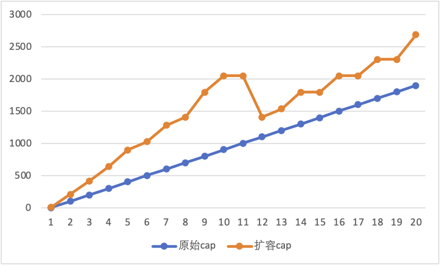
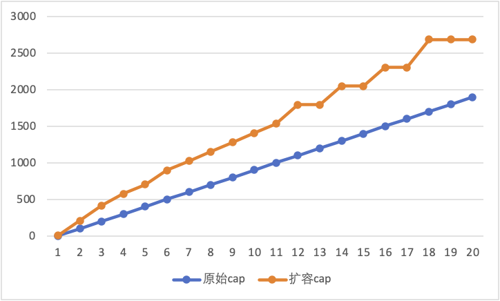

随着go 1.18版本的发布，go社区终于迎来了期盼已久的正式泛型语法，然而我在浏览关于1.18的changelog时发现1.18对于slice的扩容策略也做了一些修改，刚好我最近正在看draven大佬的新书也讲到了slice底层的源码的一些运行逻辑，在好奇心的驱使下，想知道社区究竟改动了什么以及为什么作出这些改动，于是翻开1.18的源码，便有了这篇文章。

## Growslice In Go 1.17

首先我们先简单回顾一下go 1.17及以前的切片扩容策略，这部分的主要逻辑在`src/runtime/slice.go`中的`growslice`函数（省略部分代码，下同）：

```go
func growslice(et *_type, old slice, cap int) slice {
  ...
  
  newcap := old.cap
  doublecap := newcap + newcap
  if cap > doublecap {
    newcap = cap
  } else {
    if old.cap < 1024 {
      newcap = doublecap
    } else {
      // Check 0 < newcap to detect overflow
      // and prevent an infinite loop.
      for 0 < newcap && newcap < cap {
        newcap += newcap / 4
      }
      // Set newcap to the requested cap when
      // the newcap calculation overflowed.
      if newcap <= 0 {
        newcap = cap
      }
    }
  }
  
  ...
}
```

上面代码的扩容策略可以简述为以下三个规则：

1.   当期望容量 > 两倍的旧容量时，直接使用期望容量作为新切片的容量
2.   如果旧容量 < 1024（注意这里单位是元素个数）,那么直接翻倍旧容量
3.   如果旧容量 > 1024，那么会进入一个循环，每次增加25%直到大于期望容量

可以看到，原来的go对于切片扩容后的容量判断有一个明显的magic number：1024，在1024之前，增长的系数是2，而1024之后则变为1.25。关于为什么会这么设计，社区的相关讨论[^group-discussion]给出了几点理由：

1.   如果只选择翻倍的扩容策略，那么对于较大的切片来说，现有的方法可以更好的节省内存。
2.   如果只选择每次系数为1.25的扩容策略，那么对于较小的切片来说扩容会很低效。
3.   之所以选择一个小于2的系数，在扩容时被释放的内存块会在下一次扩容时更容易被重新利用。

关于3的原理也很简单，对于一个2为公比的等比数列，那么其前（n-1）项和必然小于第n项：
$$
\sum(2^0,2^1,2^2,...,2^{(n-1)}) = 2^{n-1}-1 < 2^n
$$
也就是说，如果按2为系数进行扩容，那么**每一次扩容所需要的空间都大于之前释放的所有空间之和**，那么也就谈不上重新利用了。

可以看到当前方法也是作出了一些权衡，希望同时兼顾扩容效率和内存利用率，而以1024为分界点多半也是写代码人的个人喜好。

## What's the problem？

上面的扩容策略一直使用了许多年，但它仍然存在一个问题：那就是扩容策略并**不是一个单调函数**。

对于扩容策略不是单调函数，我们用下面的代码来做验证：

```go
func main() {
  for i := 0; i < 2000; i += 100 {
    fmt.Println(i, cap(append(make([]bool, i), true)))
  }
}
```

这段代码通过申请一个长度为`i`的切片，然后对其append一个元素来触发扩容。每次实验新增加100个元素，同时打印扩容前后的大小（单位byte）：



其中蓝色的线代表扩容前的每次容量大小变化，橙色线代表对应扩容后的大小变化，横坐标为实验序号，纵坐标为容量大小。

可以看到在第11次与第12次扩容后，扩容后的容量反而出现了下降，由于存在内存对齐，所以最后的容量会向上取一个合理的数值。

|            | 扩容前容量 | 扩容后容量 |
| ---------- | ---------- | ---------- |
| **第11次** | 1000       | 2048       |
| **第12次** | 1100       | 1408       |

## Growslice In Go 1.18

接下来我们回到刚刚发布的go 1.18版本中，在1.18中，优化了切片扩容的策略[^github-commit]，让底层数组大小的增长更加平滑：

```go
func growslice(et *_type, old slice, cap int) slice {
  ...
  
  newcap := old.cap
  doublecap := newcap + newcap
  if cap > doublecap {
    newcap = cap
  } else {
    const threshold = 256
    if old.cap < threshold {
      newcap = doublecap
    } else {
      // Check 0 < newcap to detect overflow
      // and prevent an infinite loop.
      for 0 < newcap && newcap < cap {
        // Transition from growing 2x for small slices
        // to growing 1.25x for large slices. This formula
        // gives a smooth-ish transition between the two.
        newcap += (newcap + 3*threshold) / 4
      }
      // Set newcap to the requested cap when
      // the newcap calculation overflowed.
      if newcap <= 0 {
        newcap = cap
      }
    }
  }
  
  ...
}
```

重点关注第6行以后的代码，修改原来的1024为一个值为256的`threshold`，大于阈值后的新容量的计算也由原来的
$$
newcap = oldcap + \frac{oldcap}{4} \space\space\space\space\space \text{if $oldcap \geq 1024$}
$$
变为了
$$
newcap = oldcap + \frac{oldcap + 3 \times threshold}{4} \space\space\space\space\space \text{if $oladcap \geq threshold$}
$$
通过减小阈值并固定增加一个常数，使得优化后的扩容的系数在阈值前后不再会出现从2到1.25的突变，该commit作者给出了几种原始容量下对应的“扩容系数”：

| 原始容量 | 扩容系数 |
| -------- | -------- |
| 256      | 2.0      |
| 512      | 1.63     |
| 1024     | 1.44     |
| 2048     | 1.35     |
| 4096     | 1.30     |

我们重新验证一下前一节中的代码，可以看到1.18中优化后的扩容策略可以保证是一个单调函数



## The End

这次问题源自于社区成员对于扩容机制中魔数的疑问，而对于整个runtime来说，slice的扩容只是其中最简单的冰山一角，即使如此，我们也看到社区对于细节问题的重视，通过一点一点的优化让golang能够不断进步。对于gopher来说，我们在使用golang的时候往往不会注意其背后的运行原理，因为go已经把一切都做好了，这也是我喜欢golang的原因，在“少即是多”的原则之下，go把许多复杂的运行机制很好的隐藏在runtime的源码之中，从而带给gopher最好的编程体验。而研究runtime的运行机制，便能够发现许多类似这种问题，通过研究社区的解决方法，也不失为一种乐趣。

## References

封面来自: [https://www.pixiv.net/artworks/96944986](https://www.pixiv.net/artworks/96944986)

[^github-commit]: [runtime: make slice growth formula a bit smoother · golang/go@2dda92f (github.com)](https://github.com/golang/go/commit/2dda92ff6f9f07eeb110ecbf0fc2d7a0ddd27f9d)
[^group-discussion]: [slices grow at 25% after 1024 but why 1024? (google.com)](https://groups.google.com/g/golang-nuts/c/UaVlMQ8Nz3o)
