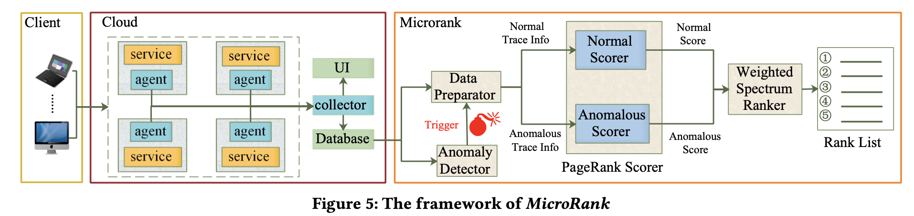
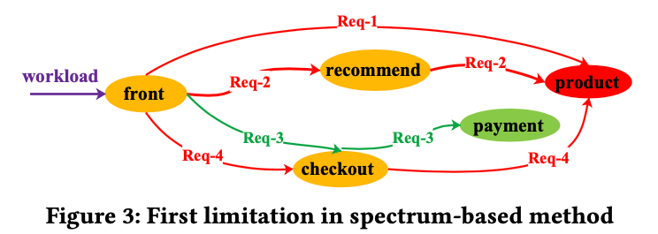
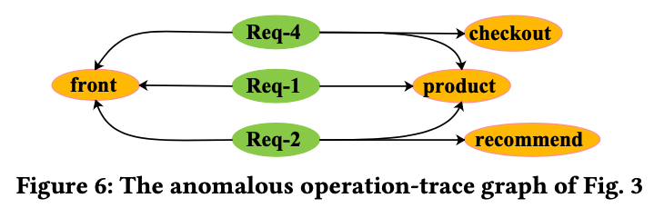

> 论文标题：MicroRank: End-to-End Latency Issue Localization with Extended Spectrum Analysis in Microservice Environments
>
> 论文来源：WWW21
>
> 论文链接：[MicroRank: End-to-End Latency Issue Localization with Extended Spectrum Analysis in Microservice Environments | Proceedings of the Web Conference 2021 (acm.org)](https://dl.acm.org/doi/10.1145/3442381.3449905)
>
> 源码链接：

## TL;DR

这篇文章提出了一个利用谱分析实现根因定位的方法：MicroRank，通过收集分析异常合正常的trace数据，来定位延迟问题的根因，当MicroRank的异常检测器检测到发生延迟问题时，就会触发根因定位的过程：MicroRank首先会利用一个PageRank的打分器不同trace进行重要性评估，然后谱分析（spectrum analysis）利用打分器得出的权重来计算根因排序。通过在广泛使用的开源微服务系统和生产系统中，对比其他根因定位方法，如CauseInfer合Sieve，MicroRank可以得到更加有效的结果。

## Algorithm

### Spectrum-based fault localization

Spectrum-based fault localization (SBFL) ，谱分析在故障定位中是比较有效且简单的方法。简单来说，在一个程序$P$和其对应的测试集合中，对于程序中的每一个元素$O\in P$，定义一个四元组：

$$
(O_{ef},O_{ep},O_{nf},O_{np})
$$
$O_{ef}$: 覆盖O的测试case中失败的数量

$O_{ep}$: 覆盖O的测试case中通过的数量

$O_{nf}$: 没有覆盖O的测试case中失败的数量

 $O_{np}$: 没有覆盖O的测试case中通过的数量

类似软件测试中的思路，当经过一个服务执行的异常trace越多且执行正常trace的数量越少，那么这个服务越有可能是导致异常的根因。

### System

MicroRank主要分为四个部分：Anomaly Detector, Data Preparator, PageRank Scorer 和 Weighted Spectrum Ranker

系统通过一个时间窗口（文中是30s），如果实时的异常大于一个期望值，就认为出现了异常，并触发根因定位，由Data Preparator来区分时间窗口内的正常/异常trace，并且构建调用图，由一个基于PageRank的打分器为每一个operation（即服务接口，下文同）进行异常分数和正常分数的打分，输入到Spectrum Ranker不断的更新权重进行排序

### Anomaly Detector

异常检测器主要计算每个operation在一段时间（比如一个小时）内的平均处理时间 $\mu_o$ 和标准差 $\delta_o$ ,文中特别说明了只有在出现预测偏差的时候才需要更新上述的两个值。

在一个时间窗口内，异常检测需要统计trace涉及的operation以及对应的数量 $count_o$ ，通过下面式子计算期望一条trace的期望响应时间 $L_{excepted}$ ：

$$
L_{excepted} = \sum count_o \times (\mu_o + n \times \delta_o)
$$
一条trace的期望响应时间计算为各个operation的n sigma的乘积的和，在文中$n=1.5$，如果实际trace的响应时间大于期望值，则会被认为是异常trace，同时触发根因定位并刷新时间窗口。

这里其实存在一些问题：对于OpenTracing格式的span来说，各个span的duration是包含了子span的duration，理论上只需要计算root span的duration即可，不需要累加每个span的duration。

### PageRank Scorer

文中为了提高谱分析的性能，增加了一个基于PageRank的打分器，分别对异常和正常的trace进行游走计算权重信息。基本思想就是对trace上的每一个operation进行打分来评价trace的重要性，越能够帮助找到根因的trace重要性会越高：

1. 如果一个operation被越多的异常trace经过，那么它很有可能是根因
2. 如果一个异常trace经过了越少的operation，那么这条trace的重要性越高，因为它包含根因的范围更小（更容易定位根因）
3. 如果一种trace出现的数量越少，那么也需要给予更高的重要性

经过PageRank会得出一个得分向量$v$：
$$
v^{(q)} = dAv^{(q-1)} + (1-d) \cdot u
$$
$d$是参数，$q$是迭代次数，每次进行迭代计算都会更加接近最终的结果，除此之外这个向量还需要矩阵$A$与向量$u$，其中$A$是关于operation和trace的矩阵：
$$
A = 
\left[
\begin{array}{c|c}
\overbrace{A_{oo}}^{operations} & \overbrace{A_{ot}}^{traces} \\
\hline A_{to} & 0
\end{array}
\right]
$$
其中$A_{st}$代表了从s出发到t结束的矩阵，矩阵中的值代表转移的概率，即$\frac{1}{相邻节点的数量}$。作者把每一次请求看作图中的一个单独的节点，构造了operation-trace的关系图，如下面图3到图6的变化：

基于图6，我们便能得出一个关于向量$[front, recommend, checkout, product, req1, req2, req4]$的异常关系矩阵：
$$
A = 
\left[
\begin{array}{cccc|ccc}
0&0&0&0&1/2&1/3&1/3 \\
1/3&0&1/3&0&0&1/3&0 \\
1/3&0&0&0&0&0&1/3 \\
1/3&1&1&0&1/2&1/3&1/3 \\
\hline
1/3&0&0&1/3&0&0&0 \\
1/3&0&1&1/3&0&0&0 \\
1/3&1&0&1/3&0&0&0 \\
\end{array}
\right]
$$
作者认为系统的接口之间的调用关系图，即$A_{oo}$， 是相对稳定的，而根因往往对operation-trace图，即$A_{ot}$和$A_{to}$影响更大，于是通过增加一个参数${\omega}(0\le\omega\le1)$来降低调用关系图的影响：
$$
A = 
\left[
\begin{array}{c|c}
\omega A_{oo} & A_{ot} \\
\hline A_{to} & 0
\end{array}
\right]
$$
文中用向量$u$来计算trace覆盖范围和种类数量的影响：$u = [u_o^T, u_t^T]^T$，其中只需要考虑trace的影响，故operation的向量$u_o$是$\vec{0}$。对$u_t$来说，每一条异常trace的重要性得分$\theta_i$遵循以下计算方法：
$$
\theta_i = \varphi\cdot\frac{n_i^{-1}}{\sum n_j^{-1}} + (1-\varphi)\cdot\frac{k_i^{-1}}{\sum k_j^{-1}}
$$
$n_i$为异常trace $i$经过operation的数量（覆盖范围），$k_i$则为该异常trace的数量。$0\le\varphi\le1$，文中默认为0.5，用于平衡trace范围和trace数量的参数。对于正常的trace，则经过operation的数量并不能够反应重要性（因为它们的结构都是一样的），因此只需要计算$\frac{k_i^{-1}}{\sum k_j^{-1}}$即可。

当计算出矩阵$A$与向量$u$后，则可以计算pagerank分数，初始化$v$:
$$
v^{(0)}=[v_o^T, v_t^T]^T=[\frac{1}{N_o},\frac{1}{N_o},\cdots,\frac{1}{N_o},\frac{1}{N_t},\frac{1}{N_t},\cdots,\frac{1}{N_t}]^T
$$
$N_o$和$N_t$分别是operation数量和trace种类的数量（上文例子中的req1,2,3则为三种trace），通过（3）式迭代计算（实例代码中迭代次数为25），最后得出正常的评分P和异常trace评分向量

### Weighted Spectrum Ranker

最后，按照谱分析的方法，计算开头式(1)中提到的四个值：
$$
\begin{array} \\
O_{ef} = F * N_{ef}, & O_{nf} =  F * (N_f - N_{ef}) \\
O_{ep} = P * N_{ep}, & O_{np} = P * (N_p - N_{ep})
\end{array}
$$

## Experiments

## Thoughts

1. 作者认为调用关系是稳定的，然而现实情况是可能业务系统中只有部分系统能够维持稳定的调用关系
