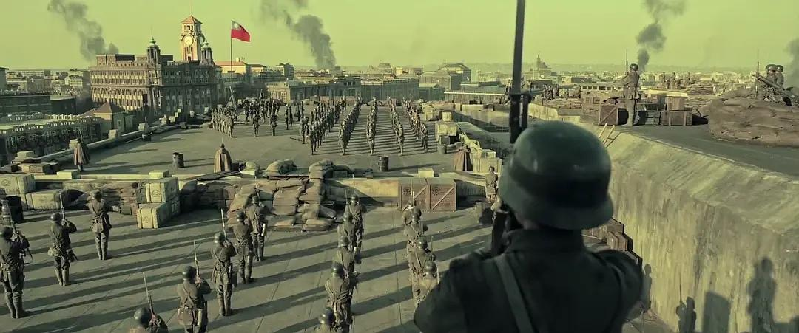
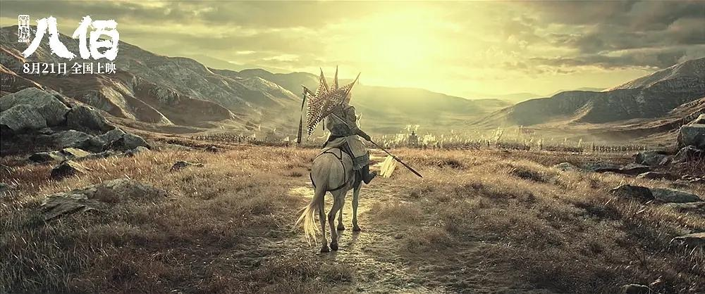
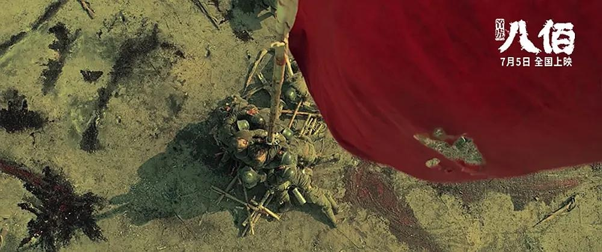

# 八佰看完了随便谈谈

## 我先给《八佰》一个好评

《八佰》看完了，还专门去看了IMAX版。尽管这部电影从宣发到撤档再到重新定档上映，之间备受争议。但我还说要说，仅从抗战电影本身来说，这是部好电影，甚至超出了我之前看过的所有抗战片，我要给它很高的评价。《八佰》的出现对于中国抗战片来说有一定的特殊意义，类似《流浪地球》对于中国科幻片。这不仅因为它是一部少有的大陆拍摄的国军战役，而且制作团队对于电影的取材，伴奏配乐，画面分镜以及叙事节奏的掌握都十分出色。最后所表达的主题也很明确：**尽管这是一场必然失败的“表演”战役，但是“八佰壮士”用自己的行动向江对岸的人展示了中国军人真正的气魄，以此来唤醒更多中国人参与抗战。**这点我深表赞同。

## 个人认为唯一的争议

说说争议点，对我来说唯一让我非常不满的是导演管虎本人，《八佰》是部好电影，但是宣发的时候特意要去找八十八师师长“飞将军”孙元良的后人，孙的行为在抗战期间颇有争议，尽管是孙元良当时亲自给谢晋元下令死守四行仓库，但是因为本人的污点，不应该成为宣发时的素材。

## 历史虚无主义？

**历史虚无主义——指不加具体分析而盲目否定人类社会的历史发展过程**

有人批评电影有历史虚无主义的嫌疑，认为一方面历史中日军并没有猛攻四行仓库，且电影中刻意夸大了国军的表现，认为事实中的国军并不是为了保卫上海而在电影中被“美化”，女学生送国旗也是从桥上光明正大地走过去而不是冒着子弹渡河。确实，电影确实在这方面有所夸张，但是电影之所以是电影而不是纪录片，为了表现主题而做适当的夸张处理，以此使感情的表达更加强烈，我觉得是可以接受的，在这一点上《八佰》确实也做到了。关于“美化”的问题，我觉得电影中处理的也比较恰当，如果我们交换时空设想一下，当时河对岸租界里的普通民众看来，对岸的中国军人在对抗日寇就是在保护自己（尽管他们也知道日军不会打到租界来），从谢晋元以及仓库里的士兵这些以执行军令为天职的军人看来，上级下达死守仓库的命令就是为了保卫上海最后一块领地而他们或许真的不知道这背后的真实目的是什么，电影中也表现了谢晋元团长的军人风度和民族气概以及士兵们视仓库为自己最后的坟墓，绝不后撤保卫上海的决心。在电影的最后，特使和谢团长的对峙中，戳破了这场战斗只是“表演”，只是为了在国际上获得同情，也是基本尊重史实的。所以我认为《八佰》出色地完成了它的任务，可以说它有虚构的成分，但最后宣扬的主题是没有问题的。既没有否定国军正面战场的妥协失利利用“表演”来博得国际社会同情的行为，也没有否定国军中也有像谢晋元及其部下英勇抗战的中国军人。

## 电影是好电影

电影最出彩的看点我认为是河两岸的这种天堂与地狱强烈对比，也是四行仓库保卫战带上一股特殊悲壮气氛的关键点，而电影中也得到了很着重的描写刻画，两岸如此相近又如此遥远，这种矛盾冲突让整部电影都笼罩在一种特殊的氛围当中，而且**越是比较，越是压抑，一次次地用镜头画面冲击人心**。电影中也运用了不少第一人称的镜头，无论是冲锋时突然满眼的鲜红色，还是深夜时对岸的灯红酒绿，都带给观众很强的心灵震撼。电影中也巧妙使用了关公意象，从对岸戏台上的表演到小湖北的想象，让观众更能体会到这场战役中仓库守军所面临的困境以及为国赴死的决心。

结局最后在“八百壮士”从桥面冲向租界撤退戛然而止，并在片尾拍摄了如今上海四行仓库的遗址，串起了历史与当今，这种对比让人更加感同身受。这是很标准的结尾，不出彩，但值得好评。

## 总结

总而言之，制作团队的努力不可否认，淞沪会战“八百壮士”的英雄事迹不该遗忘，有机会一定也去四行仓库遗址看看。最后，我希望这部电影能够走出中国，毕竟长期以来，欧洲战场太平洋战场的好片子太多了，作为东方主战场的中国，需要更多类似《八佰》这样的电影，在尊重历史的基础上，向世界展示中国在世界反法西斯战争中的决心和努力，**无论是共军还是国军**。

再给管大导演一个机会，期待他后面抗美援朝的片子。。。

ps: 金刚川看完了，属实给人看嗯了。。。
